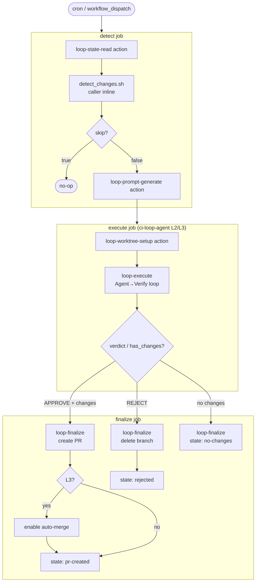
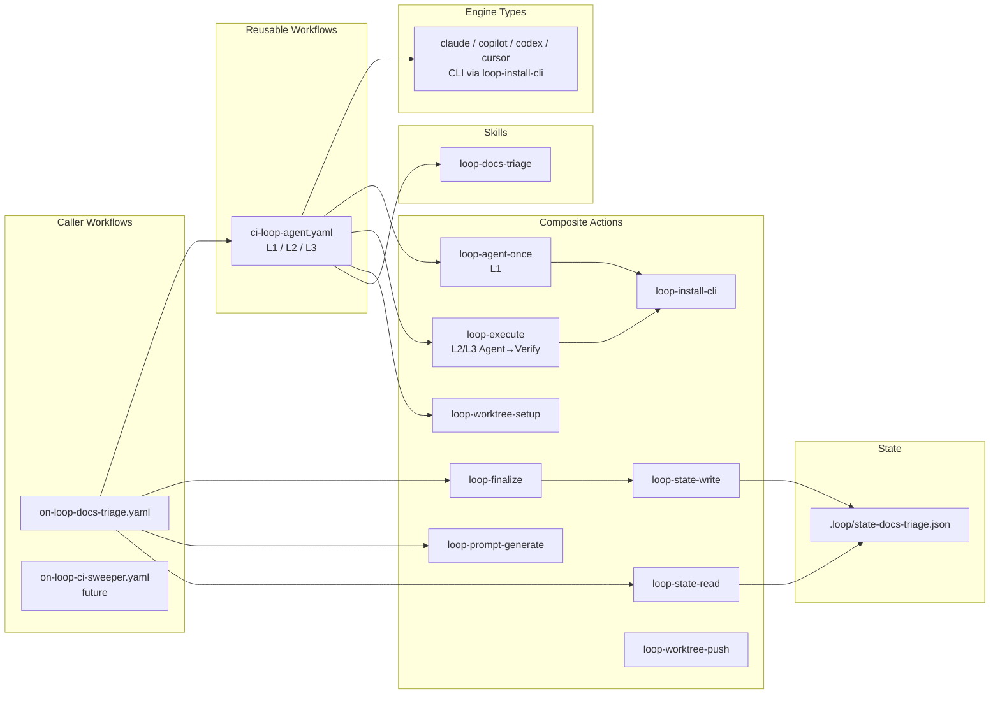
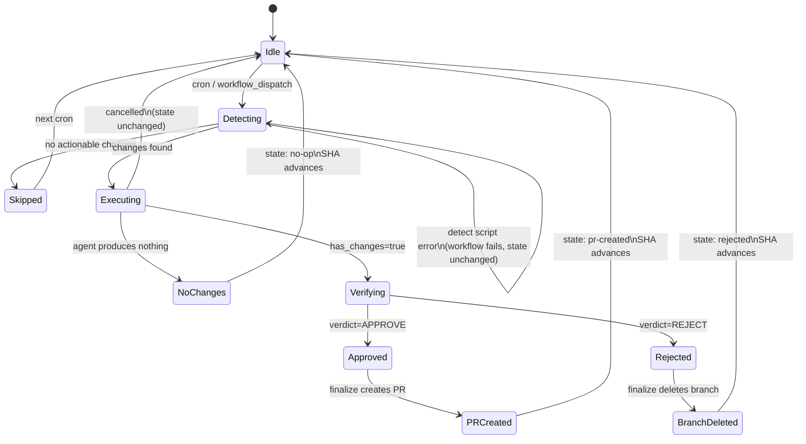

# Loop Engineering Design

This document describes the design philosophy, architecture, and design principles of Loop Engineering.
For concrete specifications (Actions/Workflows list, interfaces), see [Specification](../reference/specification.md).

## Implementation Status

| Package | Status | Level |
|---|---|---|
| `docs-loop` | ✅ Implemented | L2 (Assisted) |
| `ci-sweeper-loop` | Not started | - |
| `changelog-loop` | Not started | - |
| `issue-triage-loop` | Not started | - |
| `test-coverage-loop` | Not started | - |
| `stale-pr-loop` | Not started | - |

## Loop Candidate Roadmap

Referencing the design philosophy of GitHub Agentic Workflows ([official blog](https://github.blog/ai-and-ml/automate-repository-tasks-with-github-agentic-workflows/), [Self-Healing CI case study](https://pascoal.net/2026/03/12/self-healing-ci-using-gh-aw/)), the following loops are under consideration.

### Tier 1 (High Priority — Implementable with Existing Infrastructure)

| Loop | Detection Method | Agent Behavior | Expected Level |
|---|---|---|---|
| **ci-sweeper** | GitHub API: retrieve failed workflow runs | Auto-fix lint/build errors, create PR | L2 → L3 |
| **changelog** | git log: parse conventional commits | Auto-generate/update CHANGELOG.md | L2 |

### Tier 2 (Medium Priority — Additional Detect Action Required)

| Loop | Detection Method | Agent Behavior | Expected Level |
|---|---|---|---|
| **issue-triage** | GitHub API: retrieve unlabeled issues | Codebase analysis → label assignment + comment | L1 → L2 |
| **stale-pr** | GitHub API: retrieve PRs with no updates for 7+ days | Review comment or close suggestion | L1 |
| **test-coverage** | CI artifacts: parse coverage reports | Auto-generate missing tests, create PR | L2 |

### Tier 3 (Low Priority — Complex Safety Measures)

| Loop | Detection Method | Agent Behavior | Expected Level |
|---|---|---|---|
| **dependency-update** | Detect CI failures on Renovate PRs | Auto-fix breakage caused by dependency updates | L2 |
| **security-advisory** | GitHub Advisory DB: new CVEs | Create PR for vulnerability remediation | L1 (report only) |
| **api-docs** | OpenAPI spec diff detection | API documentation sync | L2 |

### Selection Criteria

Priority assessment when adding new loops:

1. **ROI**: Manual handling frequency × time per occurrence > loop construction cost
2. **Safety**: Is the file scope restrictable via allowlist?
3. **Verifiability**: Are there clear criteria that a verifier can evaluate?
4. **Graduated Promotion**: Promote to L2 only after 2+ weeks of stable operation at L1

### References

- [GitHub Agentic Workflows Official](https://docs.github.com/en/copilot/concepts/agents/about-github-agentic-workflows)
- [GitHub Blog: Automate repository tasks](https://github.blog/ai-and-ml/automate-repository-tasks-with-github-agentic-workflows/)
- [Self-Healing CI with GitHub Agentic Workflows](https://pascoal.net/2026/03/12/self-healing-ci-using-gh-aw/)
- [Transform Your SDLC with Agentic Workflows](https://colinsalmcorner.com/transform-sdlc-with-agentic-workflows/)

## Package Structure

```text
.apm/packages/
  docs-loop/             ← docs update loop (self-contained)
  ci-sweeper-loop/       ← future: CI failure fix loop
  changelog-loop/        ← future: changelog drafting loop
```

## Naming Conventions

| Package Type | Naming Pattern | Example |
|---|---|---|
| Domain-specific loop | `<domain>-loop` | `docs-loop`, `ci-sweeper-loop` |

## Dependencies

Each `*-loop` package is self-contained (no dependencies on other packages).
APM packages provide Skills only and do not distribute Workflows/Actions.

## docs-loop (Docs Update Loop)

| Component | Description |
|---|---|
| `.apm/skills/loop-docs-triage/SKILL.md` | Skill that performs document editing based on triage findings |
| `eval.yaml` + `evals/tasks/` | waza evaluation suite |

For a list of Actions and Reusable Workflows, see [Specification](../reference/specification.md).

## Execution Flow

```text
cron → on-loop-docs-triage.yaml
  detect job:
    → loop-state-read action              # retrieve previous SHA
    → detect_changes.sh (inline)          # detect docs impact (caller-specific)
    → loop-prompt-generate action         # assemble prompt
  execute job:
    → ci-loop-agent.yaml (reusable)       # L1: loop-agent-once; L2/L3: worktree + loop-execute
      → loop-worktree-setup action        # isolated branch (L2/L3)
      → loop-execute action               # bounded Agent→Verify loop (denylist + retries)
  finalize job:
    → loop-finalize action                # create PR (+ auto-merge at L3) or delete branch + update state
```

### Workflow Architecture Diagram



### Component Structure Diagram



## STATE Files

State files are maintained individually per loop (multi-loop coordination principle). JSON format.

```text
.loop/
  state-docs-triage.json    ← owned by docs-loop
  state-ci-sweeper.json     ← future: owned by ci-sweeper-loop
  state-changelog.json      ← future: owned by changelog-loop
  .gitkeep
```

- State read/write is handled by `loop-state-read` / `loop-state-write` actions
- `.gitattributes` is configured with `merge=ours` to prevent merge conflicts
- On first run, `loop-state-read` returns a default value (HEAD~10) even if the state file does not exist

## L2 Promotion Requirements

| Requirement | Approach | Status |
|---|---|---|
| loop-budget skill | Download from npm/GitHub Release with caching (repository-independent) | Future |
| loop-verifier skill | Same as above | Future |
| Maker-Checker separation | Implemented inside `loop-execute` (via `ci-loop-agent.yaml` L2/L3) | ✅ Implemented |
| Worktree isolation | loop-worktree-setup + loop-execute (inline commit/push) + ci-loop-agent L2 mode | ✅ Implemented |
| Denylist / Allowlist | Defined in SKILL.md, checked by verifier | ✅ Implemented |

## Design Principles

### Component Design Principles

| Type | Location | Principle |
|---|---|---|
| Reusable Workflow | `.github/workflows/ci-loop-*.yaml` | Generic logic only. Domain-specific criteria are passed from the caller via inputs |
| Composite Action | `.github/actions/loop-*` | Aggregation of generic steps. Must not depend on specific scripts or repository-specific paths |
| Caller Workflow | `.github/workflows/on-loop-*.yaml` | Domain-specific logic (detection script invocation, criteria definition) is written here |
| APM Package | `.apm/packages/*-loop/` | Distributes Agent Skills only. Does not distribute Workflows or Actions |
| Skill | `.apm/packages/*-loop/.apm/skills/` | Defines Agent behavioral constraints. Does not reference external skills (self-contained) |

**Decision criterion**: If the answer to "Can another repository use this via remote reference?" is YES, it belongs in an action/workflow. If NO (depends on specific paths or scripts), write it inline in the caller.

### Maker-Checker Separation (Most Important Principle)

The implementation agent (Maker/Implementer) and the verification agent (Checker/Verifier) must always be separate agent sessions. If the same agent verifies its own output, confirmation bias occurs and errors are overlooked.

Verifier design principles:

- Default stance is "reject" (look for reasons to reject, not to approve)
- Prompt must include CI test output and lint results as mandatory inputs
- Use a model that is more powerful than, or from a different family than, the implementation agent
- `/goal` stop condition evaluation is also performed with a fresh model (not the same model as the implementer)

### Design Stop Conditions First

Design how a loop stops before creating the loop itself. Never launch L3 without stop conditions.

3-tier stop levels:

| Level | Example Trigger |
|---|---|
| Slow Down (decelerate) | Token budget exceeds 80% / false positive rate exceeds 30% |
| Pause (temporary halt) | Production incident in progress / schema migration |
| Kill (complete stop) | 2 consecutive S2+ incidents / cost-to-value inversion for 2 consecutive weeks |

### Graduated Autonomy (L1 → L2 → L3 Promotion Rules)

New patterns always start at L1. Even if an existing loop is at L3, new features start at L1.

| Tier | Description | Approximate Duration |
|---|---|---|
| L1 (Report) | STATE.md update only. No code changes | 1-2 weeks |
| L2 (Assisted) | Worktree modifications + PR creation only when verifier approves. Auto-merge limited to path allowlist | Consider L3 after stabilization |
| L3 (Unattended) | Only when denylist + budget cap + metrics + human gate are all established | Only after conditions are met |

L1 → L2 migration checklist:

- State file schema is documented
- SKILL.md includes build / test commands
- Implementer and verifier are separate sessions
- Denylist explicitly includes auth, payments, secrets, and infrastructure
- Auto-merge eligible paths are restricted via allowlist
- Daily token cap and maximum sub-agent count are configured

### Token Budget Management

Token costs tend to increase quadratically as conversation accumulates.

Cost compression patterns:

| Pattern | Token Reduction Rate (reference) |
|---|---|
| Scope limitation (sub-agent separation) | ~40% |
| Coordinator/specialist separation | ~54% |
| Context trimming (every 10-15 calls) | ~23% |
| Prompt caching (fixed prompts) | Up to 90% for fixed portions only |

Design countermeasures:

- Execute triage path with an inexpensive model, invoke a powerful model only when actionable items exist
- Early exit for watchlists with no items (greatest cost reduction opportunity)
- Context reset at phase boundaries (triage → fix → verify)
- Set daily cap, pause at 80% utilization

### Worktree Isolation

For L2 and above where auto-fixes are performed, branch isolation is mandatory. The implementation method differs by engine type.

**Engine strategy classification:**

| Strategy | Engine | Branch Management | Working Directory |
|---|---|---|---|
| Action-managed | claude-code-action | Action internally creates branch, commits, and pushes | Fixed to GITHUB_WORKSPACE |
| CLI type | copilot, codex, claude-cli | Externally managed via loop-worktree-setup; commit/push inside loop-execute | Isolated in worktree path |

**Unified contract**: Regardless of engine, `ci-loop-agent.yaml` outputs `{ branch, has_changes, verdict, reason, attempts }` at L2/L3. Maker-Checker verification runs inside `loop-execute` before finalize.

**CLI type principles:**

- 1 item = 1 worktree
- If verifier REJECTs, delete branch to discard all changes
- Delete worktree after task completion

**Procedure for adding a new engine:**

1. Action-managed: Add an L2 job individually, obtain branch_name from output
2. CLI type: Simply add the engine to the case statement in the `agent-cli-l2` job

### Denylist / Least Privilege

MCP connectors and file modifications follow the principle of least privilege.

```yaml
# Path denylist (shared across all loops)
path_denylist:
  - "**/.env"
  - "**/credentials*"
  - "**/secrets*"
  - "**/migration/*.sql"
  - "**/infrastructure/**"
```

Per-tier permissions:

| Tier | Allowed Scope |
|--------|---------| 
| L1 | Read-only. Write only to PR comments |
| L2 | Limited write to approved paths. Branch creation permitted |
| L3 | Write to paths within allowlist. Auto-merge requires allowlist |

### Multi-loop Coordination

5 principles when multiple loops operate on the same repository:

1. **Exclusive branch ownership**: Only one loop may operate on a branch at a time
2. **State file separation**: Each loop has its own dedicated state file (`state-triage.md` / `state-pr-watcher.md`)
3. **Role separation**: Triage loops are L1 report-only. Action loops execute independently
4. **Unified denylist**: All loops share the same path denylist
5. **Aggregated budget management**: Token consumption across all loops is aggregated against a daily budget cap

Conflict detection is performed by each Action loop checking the `acting_on` field in peer state files before execution.

### Failure Mode Countermeasures

| Symptom | Cause | Countermeasure |
|---|---|---|
| Same PR auto-fixed 5+ times | Weak verifier (Infinite Fix Loop) | Retry limit of 3. Replace verifier with a more powerful model |
| CI fails but verifier approves | Test execution skipped (Verifier Theater) | "Look for reasons to reject" framing. Make test output mandatory |
| Closed items accumulate in STATE.md | No pruning (State Rot) | Delete closed items on each execution. Separate files per loop |
| Team cannot understand change intent | Auto-merge expansion (Comprehension Debt Spiral) | Mandatory weekly digest. Route medium-risk to human gate |
| Quality degrades due to context bloat | Unlimited conversation history accumulation (Context Rot) | Reset at phase boundaries. Trim every 10-15 calls |

### Design Invariants

Absolute rules that must never be violated regardless of loop type, level, or engine. Use these as the primary checklist during design review.

1. **Agent never writes to the default branch directly** — All modifications happen on isolated branches
2. **Verifier never modifies the repository** — Verify phase is strictly read-only
3. **Detect never writes state** — State changes only in Finalize
4. **Finalize never changes source code** — It persists outcomes (PR, state) but does not alter application/documentation files
5. **State advances only through Finalize** — No other phase may commit to the state file
6. **Each phase communicates only via outputs/inputs** — No implicit filesystem coupling between jobs
7. **Checkout is the caller's responsibility** — Composite Actions must not perform checkout internally
8. **Every decision is traceable** — Each phase must produce structured output sufficient to reconstruct why a decision was made (skip reason, reject reason, outcome)

### Metrics

Key indicators for evaluating loop health. Measurement infrastructure is not required at L2, but these definitions guide L3 promotion decisions.

| Metric | Definition | Target (L2) |
|---|---|---|
| Approval Rate | APPROVE / (APPROVE + REJECT) per period | > 70% |
| Skip Rate | skip=true / total executions | Context-dependent (high is fine for stable repos) |
| Average Runtime | Wall-clock time from trigger to finalize | < 15 min |
| Token Usage | Total tokens consumed per execution (agent + verifier) | Track, no hard cap at L2 |
| PR Merge Rate | Merged PRs / Created PRs | > 80% |
| Human Override Rate | PRs closed or edited by humans / Created PRs | < 30% |
| Consecutive Failure Count | Sequential rejected or errored runs | Alert at 3+ |

**L3 promotion gate**: A loop may be promoted to L3 only when Approval Rate > 80%, PR Merge Rate > 90%, and Human Override Rate < 10% over a 2-week window.

### Retry Policy

Defines how a loop behaves when an execution fails or is rejected.

**Retry scope**: Retry occurs across cron executions, not within a single Workflow run. A single run either succeeds or fails — it does not self-retry.

**State Transition Diagram:**



**Key invariant**: SHA advances whenever Finalize runs successfully. Only detect-phase failures or cancellations leave SHA unchanged, causing the next cron to retry from the same point.

**Policy by failure type:**

| Failure Type | Behavior | State Record |
|---|---|---|
| Detect failure (script error) | Workflow fails. No state update. Next cron retries from same SHA | No change |
| Agent produces no changes | Finalize records `no-op`. SHA advances. Next cron scans only new commits | `outcome: no-op` |
| Verifier REJECT | Finalize deletes branch, records rejection. SHA advances. The rejected diff is not retried — only new commits are scanned | `outcome: rejected` |
| Verifier APPROVE → PR CI fails | PR remains open (blocked by Required Status Checks). SHA advances. ci-sweeper-loop handles cleanup | `outcome: pr-created` |
| Agent job cancelled (user/concurrency) | Finalize does not run. No state update. Next cron retries from same SHA | No change |

**Design rationale**: SHA always advances on successful detect (even if later phases fail). This prevents infinite retry of the same failing diff. If the underlying issue persists, new commits touching the same area will trigger a fresh detection.

**Consecutive failure handling:**

| Consecutive Failures | Action |
|---|---|
| 1 | Normal — recorded in state |
| 2 | State records `consecutive_failures: 2`. Consider alerting via PR comment |
| 3+ | Loop pauses (skip=true until manual reset). Escalate via notification |

**Implementation**: `loop-finalize` increments `consecutive_failures` in state on rejection. `detect_changes.sh` checks this counter and sets `skip=true` when threshold is exceeded.

**Reject reason recording**: On REJECT, Finalize writes the verifier's `reason` field to state. This enables future feedback loops where reject reasons are analyzed to improve prompts or detect systematic issues.

```json
{
  "last_sha": "abc123",
  "last_run": "2026-06-26T09:00:00Z",
  "outcome": "rejected",
  "consecutive_failures": 2,
  "last_reject_reason": "Changes included hallucinated API endpoint not present in codebase"
}
```

**Relationship to Stop Conditions**: Retry policy operates below the Stop Conditions tier. If consecutive failures trigger a Kill-level stop condition, the loop is permanently disabled until manual intervention.

### Phase Contract

Defines the responsibilities, inputs, outputs, and boundaries for each phase of a loop execution. When creating a new loop, implement each phase according to this contract.

#### Detect

| Aspect | Definition |
|---|---|
| **Responsibility** | Determine whether actionable work exists. Output a structured description of what needs to be done |
| **Input** | Previous state (last_sha), repository contents |
| **Output** | `skip` (bool), `result` (structured JSON describing changes), config values |
| **May modify** | Nothing. Read-only phase |
| **Caller-specific** | Detection script, scope definition, filtering logic |
| **Generic** | State read, config output, prompt generation |

#### Agent (Execute)

| Aspect | Definition |
|---|---|
| **Responsibility** | Produce code/content changes based on the prompt. Operate within the constraints defined by the Skill |
| **Input** | Prompt text, skill name, engine, model, level |
| **Output** | `branch` (string), `has_changes` (bool) |
| **May modify** | Files within the Skill's allowed paths, on an isolated branch only |
| **Must not modify** | Files on denylist. Files outside allowed paths. Default branch directly |
| **Contract** | Regardless of engine strategy, always outputs `{ branch, has_changes }` |

#### Verify

| Aspect | Definition |
|---|---|
| **Responsibility** | Independently evaluate whether Agent output meets quality criteria. Default stance is reject |
| **Input** | Agent branch, base branch, verifier criteria, denylist |
| **Output** | `verdict` (APPROVE / REJECT), `reason` (string) |
| **May modify** | Nothing. Read-only phase |
| **Must be** | A separate agent session from the Agent phase (Maker-Checker separation) |
| **Evaluates** | Semantic quality (factual accuracy, relevance, no hallucination). Does NOT evaluate lint/CI — that is CI's responsibility |

#### Finalize

| Aspect | Definition |
|---|---|
| **Responsibility** | Persist the outcome. Create PR on approval, delete branch on rejection, update state |
| **Input** | All prior phase outputs (branch, has_changes, verdict, current_sha) |
| **Output** | PR URL (on success), updated state file |
| **May modify** | State file (commit + push to default branch). PR creation/deletion on agent branch |
| **Must not** | Perform notifications, trigger downstream workflows, or modify code. Finalize is a persistence layer only |

#### Skill

| Aspect | Definition |
|---|---|
| **Responsibility** | Define behavioral constraints for the Agent: what it can do, what it must not do, and how it should approach the task |
| **Composition** | Prompt template + allowed paths + behavioral rules + tool constraints |
| **Guarantees** | Agent operating under a Skill will not modify files outside the allowed paths (enforced by Verifier + denylist). Agent will follow the approach defined in the Skill |
| **Does not guarantee** | Correctness of output (that is the Verifier's job). CI passing (that is CI's job) |
| **Self-contained** | A Skill must not reference external skills or repository-specific paths outside its domain |

#### Phase Boundary Rules

1. Each phase communicates only via GitHub Actions outputs/inputs — no shared filesystem state between jobs
2. A phase must not assume the internal implementation of a prior phase (no implicit side effects)
3. Checkout is the caller's responsibility. Actions operate on an already checked-out workspace
4. Error in any phase halts the pipeline (except Finalize, which runs on `always()` to record state)
