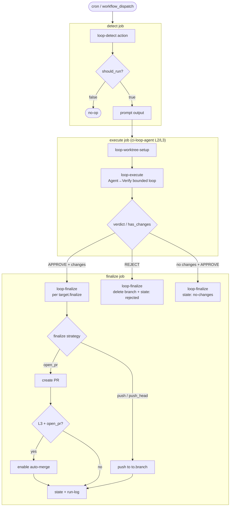
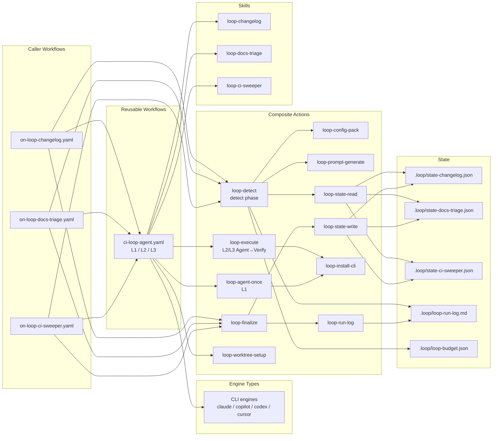
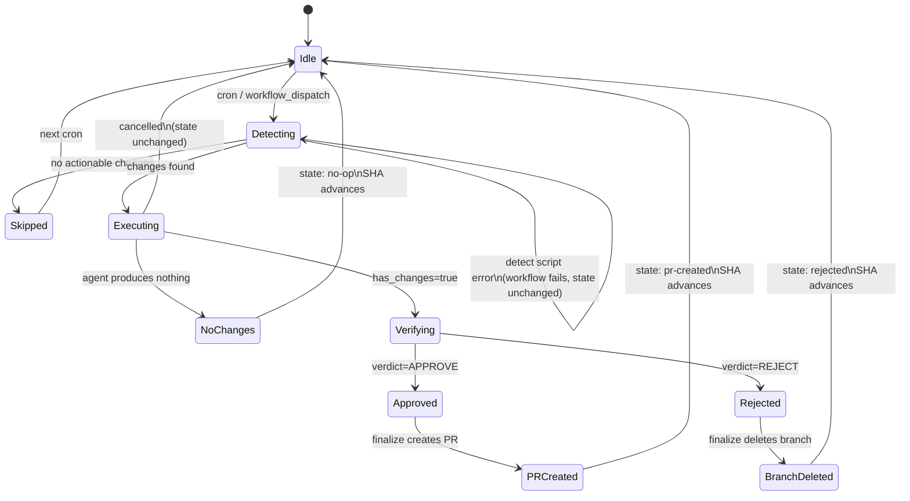

# Loop Engineering Design

This document describes the design philosophy, architecture, and design principles of Loop Engineering.
For concrete specifications (Actions/Workflows list, interfaces), see [Specification](../../reference/specification.md).

## Implementation Status

| Package             | Status                                 | Level         |
| ------------------- | -------------------------------------- | ------------- |
| `loop-docs-triage`  | Phase 0 done; multi-branch in progress | L2 (Assisted) |
| `loop-ci-sweeper`   | Phase 0 done; multi-branch in progress | L2 (Assisted) |
| `loop-changelog`    | Phase 0 done; workflow design complete | L2 (Assisted) |
| `loop-issue-triage` | Not started                            | -             |
| `loop-stale-pr`     | Not started                            | -             |

Platform actions (`loop-detect` `target_matrix`, `domain_persistence_script`) are in progress — see [Multi-Branch Loops Design](multi-branch-loops-design.md).

## Loop Candidate Roadmap

Referencing the design philosophy of GitHub Agentic Workflows ([official blog](https://github.blog/ai-and-ml/automate-repository-tasks-with-github-agentic-workflows/), [Self-Healing CI case study](https://pascoal.net/2026/03/12/self-healing-ci-using-gh-aw/)), the following loops are under consideration.

### Tier 1 (High Priority — Implementable with Existing Infrastructure)

| Loop                 | Detection Method                                    | Agent Behavior                    | Expected Level                                                                                  |
| -------------------- | --------------------------------------------------- | --------------------------------- | ----------------------------------------------------------------------------------------------- |
| **loop-docs-triage** | git diff: doc drift facts on integration branches   | Triage stale docs; open fix PR    | L2 — see [Docs Triage Workflow](workflows/loop-docs-triage-workflow-design.md)                  |
| **loop-ci-sweeper**  | GitHub API: failed runs (integration + optional PR) | Auto-fix; PR or push per mode     | L2 default; L3 opt-in — see [CI Sweeper Workflow](workflows/loop-ci-sweeper-workflow-design.md) |
| **loop-changelog**   | git log: parse conventional commits                 | Auto-generate/update CHANGELOG.md | L2 — see [Changelog Workflow](workflows/loop-changelog-workflow-design.md)                      |

#### CI failure repair — one package, layered responsibilities

`loop-ci-sweeper` stays **one loop package** (one detect script, one entry skill, one caller). CI failure repair does not split into stack-specific loop packages. Routing and defer rules split across detect facts, entry skill references, and caller config.

See also [Ubiquitous Language](CONTEXT.md) and [Detect Script Output](#detect-script-output).

##### Detect script output

Every detect script emits a common envelope (see [Specification — Detect script output](../../reference/specification.md#detect-script-output-per-context)):

| Field              | Role                               |
| ------------------ | ---------------------------------- |
| `skip`             | No actionable work in this context |
| `result`           | Domain JSON (facts only)           |
| `verifier_context` | Optional markdown for verify       |

The `result` body is **observation-trigger-specific** — not one shared schema:

| Trigger family | Loop               | Example `result` fields                                  |
| -------------- | ------------------ | -------------------------------------------------------- |
| CI failure     | `loop-ci-sweeper`  | `failures[]`, `failure_type` hint, (future) `stack_hint` |
| Doc drift      | `loop-docs-triage` | `changed_files`, `affected_docs`, …                      |
| Changelog      | `loop-changelog`   | `commits[]`, …                                           |

Semantic arrays such as `findings[]` are **Execute** output only — see [Semantic Findings](CONTEXT.md#language). Detect emits mechanical facts.

##### Execute — stack routing (A')

Distributable entry skills stay **repository-neutral**. Named domain skills (e.g. `github-actions-validation`, repo-specific sweepers) are **caller configuration** — not hardcoded in APM skill `references/`. Coupling belongs in the consumer caller YAML.

| Layer                            | Responsibility                                      | Example                                                                                  |
| -------------------------------- | --------------------------------------------------- | ---------------------------------------------------------------------------------------- |
| Detect                           | Mechanical facts                                    | `failures[]`, optional `stack_hint` from `workflow_name`                                 |
| Entry skill                      | Generic orchestration                               | Classify, read caller `## Instructions` for dispatch, fix one regression, report outcome |
| Caller `prompt_instructions`     | **Stack routing (A')** — named skills for this repo | `on-loop-ci-sweeper.yaml`: workflow → skill map                                          |
| Caller `agent_verifier_criteria` | Failure kind defer (B) appendix                     | REJECT coverage/deps fixes until domain skill exists                                     |

Platform prompt shape (`loop-detect` → `build_prompt_text`):

```text
Run the {skill_name} skill.
## Change Detection Result
{detect JSON}
## Instructions          ← caller prompt_instructions (routing + repo overlay)
## Constraints           ← level, allowlist
```

The agent reads entry skill workflow via SKILL.md; **named skill paths live in `## Instructions`**, not in distributable references.

##### Failure kind defer (B)

For failure kinds outside minimal CI repair (coverage threshold, dependency breakage):

| Layer                            | Responsibility                                                                           |
| -------------------------------- | ---------------------------------------------------------------------------------------- |
| Entry skill                      | Generic `DO NOT USE FOR`, checklist — classify Watch, no edit (no named consumer skills) |
| Caller `agent_verifier_criteria` | Appendix — REJECT diffs that address deferred kinds; may name expected domain skills     |

CI failure kinds outside minimal repair (coverage threshold, dependency breakage) stay in **`loop-ci-sweeper`** — defer via [Failure kind defer (B)](#failure-kind-defer-b), optional domain skills in caller `prompt_instructions` / verifier appendix. No separate `loop-test-coverage` package.

### Tier 2 (Medium Priority — new observation triggers)

| Loop             | Observation trigger          | Agent Behavior                                 | Expected Level |
| ---------------- | ---------------------------- | ---------------------------------------------- | -------------- |
| **issue-triage** | GitHub API: unlabeled issues | Codebase analysis → label assignment + comment | L1 → L2        |
| **stale-pr**     | GitHub API: stale PRs        | Review comment or close suggestion             | L1             |

### Tier 3 (Low Priority — Complex Safety Measures)

| Loop                  | Observation trigger          | Agent Behavior                          | Expected Level   |
| --------------------- | ---------------------------- | --------------------------------------- | ---------------- |
| **security-advisory** | GitHub Advisory DB: new CVEs | Create PR for vulnerability remediation | L1 (report only) |
| **api-docs**          | OpenAPI spec diff (git diff) | API documentation sync                  | L2               |

**CI failure extensions (not new loops):** Renovate/bot PR handling and dependency-breakage repair are **caller filters** (`pr_include_bots`, `pr_exclude`) plus domain skills under `loop-ci-sweeper` — see [CI Sweeper — dependency update](workflows/loop-ci-sweeper-workflow-design.md#dependency-update-caller-filter--domain-skill).

### Selection Criteria

Priority assessment when adding new loops:

1. **ROI**: Manual handling frequency × time per occurrence > loop construction cost
2. **Safety**: Is the file scope restrictable via allowlist?
3. **Verifiability**: Are there clear criteria that a verifier can evaluate?
4. **Graduated Promotion**: Promote to L2 only after 2+ weeks of stable operation at L1
5. **Trigger separation**: New loop packages need a distinct observation trigger (git diff, git log, GitHub API entity, CI failure sensor, …). Extending an existing trigger (e.g. coverage failure under CI) uses the same loop package + caller config — not a new `loop-*` name

### References

- [GitHub Agentic Workflows Official](https://docs.github.com/en/copilot/concepts/agents/about-github-agentic-workflows)
- [GitHub Blog: Automate repository tasks](https://github.blog/ai-and-ml/automate-repository-tasks-with-github-agentic-workflows/)
- [Self-Healing CI with GitHub Agentic Workflows](https://pascoal.net/2026/03/12/self-healing-ci-using-gh-aw/)
- [Transform Your SDLC with Agentic Workflows](https://colinsalmcorner.com/transform-sdlc-with-agentic-workflows/)

## Package Structure

Each `loop-*` package ships **Skill + detect script** (+ optional ledger script). Shared actions stay domain-agnostic.

```text
.apm/packages/
  loop-docs-triage/
    .apm/skills/loop-docs-triage/
      SKILL.md
      scripts/detect_changes.sh
  loop-ci-sweeper/
    .apm/skills/loop-ci-sweeper/
      SKILL.md
      scripts/detect_ci_failures.sh
      scripts/update_run_ledger.sh
  loop-changelog/
    .apm/skills/loop-changelog/
      SKILL.md
      scripts/detect_changelog_commits.sh
```

Hook/manual skills (e.g. `docs-updater` in `common`) are **not** loop packages — see [Docs Triage Workflow Design](workflows/loop-docs-triage-workflow-design.md#separation-from-docs-updater).

## Naming Conventions

| Package Type         | Naming Pattern                                | Example                               |
| -------------------- | --------------------------------------------- | ------------------------------------- |
| Domain-specific loop | `loop-<skill-name>` (matches skill directory) | `loop-docs-triage`, `loop-ci-sweeper` |

## Dependencies

Each `loop-*` package is self-contained (no dependencies on other packages).
APM packages provide Skills only and do not distribute Workflows/Actions.

## loop-docs-triage (Docs Update Loop)

| Component                                                | Description                                                   |
| -------------------------------------------------------- | ------------------------------------------------------------- |
| `.apm/skills/loop-docs-triage/SKILL.md`                  | Triage + document editing from detect facts                   |
| `.apm/skills/loop-docs-triage/scripts/detect_changes.sh` | Per-branch doc drift facts (`changed_files`, `affected_docs`) |
| `eval.yaml` + `evals/tasks/`                             | waza evaluation suite                                         |

## loop-ci-sweeper (CI Sweeper)

| Component                                                   | Description                                               |
| ----------------------------------------------------------- | --------------------------------------------------------- |
| `.apm/skills/loop-ci-sweeper/SKILL.md`                      | Fix / Watch / Escalate classification + minimal CI repair |
| `.apm/skills/loop-ci-sweeper/scripts/detect_ci_failures.sh` | Failed run detection (stable filters only)                |
| `.apm/skills/loop-ci-sweeper/scripts/update_run_ledger.sh`  | `domain_persistence_script` target for finalize           |

For workflow env and behavior, see [CI Sweeper Workflow Design](workflows/loop-ci-sweeper-workflow-design.md).

## loop-changelog (Changelog Maintenance)

| Component                                                        | Description                                             |
| ---------------------------------------------------------------- | ------------------------------------------------------- |
| `.apm/skills/loop-changelog/SKILL.md`                            | Keep a Changelog editing from conventional commit facts |
| `.apm/skills/loop-changelog/scripts/detect_changelog_commits.sh` | Per-branch conventional commit facts (`commits[]`)      |
| `eval.yaml` + `evals/tasks/`                                     | waza evaluation suite                                   |

For workflow env and behavior, see [Changelog Workflow Design](workflows/loop-changelog-workflow-design.md).

## Execution Flow

```text
cron → on-loop-<name>.yaml
  detect job:
    → loop-detect action                  # LOOP_* enumeration, checkout per context, detect_script per context
      → target_matrix output              # candidates for matrix fan-out
  execute job (matrix per target):
    → ci-loop-agent.yaml                  # worktree from target.from; verifier_context always wired
  finalize job (matrix per target):
    → loop-finalize                       # target.finalize + state + run-log + domain_persistence_script
```

### Workflow Architecture Diagram



### Component Structure Diagram



## STATE Files

State and observability files under `.loop/` (multi-loop coordination principle). Per-loop state is JSON; the shared run log is JSONL in a markdown file.

```text
.loop/
  state-docs-triage.json    ← owned by loop-docs-triage
  state-ci-sweeper.json     ← owned by loop-ci-sweeper
  state-changelog.json      ← owned by loop-changelog
  loop-budget.json          ← per-loop daily run/token caps (read by loop-detect)
  loop-run-log.md           ← shared JSONL run history (append via loop-run-log; 30-day prune)
  .gitkeep
```

- State read/write is handled by `loop-state-read` / `loop-state-write` actions
- `loop-finalize` invokes `loop-run-log` to append outcome, attempts, verdict, and token usage
- `loop-detect` aggregates today's entries from `loop-run-log.md` against `loop-budget.json` (or `budget_max_*` inputs) and may set `skip_reason=budget`
- `.gitattributes` is configured with `merge=ours` to prevent merge conflicts
- On first run, `loop-state-read` returns a default value (HEAD~10) even if the state file does not exist

## L2 Promotion Requirements

| Requirement              | Approach                                                                                    | Status         |
| ------------------------ | ------------------------------------------------------------------------------------------- | -------------- |
| Daily budget enforcement | `.loop/loop-budget.json` + `loop-detect` guards; usage from `loop-execute` → `loop-run-log` | ✅ Implemented |
| loop-verifier skill      | Download from npm/GitHub Release with caching (repository-independent)                      | Future         |
| Maker-Checker separation | Implemented in `loop-execute` (bounded Agent→Verify in `ci-loop-agent` L2/L3)               | ✅ Implemented |
| Worktree isolation       | `loop-worktree-setup` + push/cleanup inside `loop-execute` via `ci-loop-agent` L2/L3        | ✅ Implemented |
| Denylist / Allowlist     | Defined in SKILL.md, checked by verifier                                                    | ✅ Implemented |

## Design Principles

### Component Design Principles

| Type              | Location                            | Principle                                                                                                                              |
| ----------------- | ----------------------------------- | -------------------------------------------------------------------------------------------------------------------------------------- |
| Reusable Workflow | `.github/workflows/ci-loop-*.yaml`  | Generic logic only. Domain-specific criteria are passed from the caller via inputs                                                     |
| Composite Action  | `.github/actions/loop-*`            | Aggregation of generic steps. Must not depend on specific scripts, repository-specific paths, or domain vocabulary                     |
| Caller Workflow   | `.github/workflows/on-loop-*.yaml`  | Domain-specific logic: detection script path, verifier criteria, allowlist, `prompt_instructions`, PR metadata                         |
| APM Package       | `.apm/packages/loop-*/`             | Distributes Agent Skills only. Does not distribute Workflows or Actions                                                                |
| Skill             | `.apm/packages/loop-*/.apm/skills/` | Generic orchestration + boundaries. Named consumer domain skills live in caller `prompt_instructions`, not distributable `references/` |

**Decision criterion**: If the answer to "Can another repository use this via remote reference?" is YES, it belongs in an action/workflow. If NO (depends on specific paths or scripts), write it inline in the caller.

### Domain Isolation in Actions

`loop-*` composite actions and reusable workflows must remain domain-agnostic. When adding loops such as `ci-sweeper`, `code-review`, or tech-debt remediation, domain logic must not leak into shared actions — otherwise every new loop requires editing the action layer.

| Layer                | Domain-specific (caller / skill)                                | Generic (action / reusable workflow)                                        |
| -------------------- | --------------------------------------------------------------- | --------------------------------------------------------------------------- |
| Detection criteria   | `detect_script` path, script output (`result` facts)            | `loop-detect` enumeration, checkout, guards, `target_matrix`                |
| Implementer prompt   | `prompt_instructions`, `AGENT_VERIFIER_CRITERIA`, PR title/body | `loop-prompt-generate` constraints (level, allowlist, worktree persistence) |
| Verifier context     | Detect fact summary or CI log excerpt per target                | Always wire `verifier_context` to `loop-execute` (may be empty)             |
| Path scope           | `LOOP_ALLOWLIST`, Skill allowed paths                           | denylist defaults in `loop-execute`, allowlist enforcement                  |
| Verifier quality bar | Criteria markdown in caller `env`                               | Verifier prompt templates, JSON output contract in `loop-execute`           |
| Domain persistence   | `domain_persistence_script` path (optional)                     | `loop-finalize` invokes script with standard env; no domain logic in action |

**Caller input pattern** for a new `on-loop-*.yaml` (after [Loop Caller Reusable Workflow Design](loop-caller-reusable-design.md)):

```yaml
jobs:
  loop:
    uses: ./.github/workflows/ci-loop-caller.yaml
    with:
      loop_name: ci-sweeper
      detect_script: .agents/skills/loop-ci-sweeper/scripts/detect_ci_failures.sh
      allowlist: "src/**,tests/**"
      prompt_instructions: |
        Fix the failing CI checks identified in the detection result.
        Do not change unrelated files.
      agent_verifier_criteria: |
        ## Criteria for APPROVE
        ...
    explicit secrets: map
```

Copy `on-loop-changelog.yaml` as a thin caller template (`with:` on `ci-loop-caller.yaml`).

**Anti-patterns** (do not embed in `loop-*` actions):

- Task-specific verbs in prompt text ("triage findings", "update CHANGELOG", "fix lint errors")
- Hardcoded file paths or glob patterns for a single loop
- Domain-specific default commit messages or PR templates inside actions

`loop-prompt-generate` is the boundary for prompt assembly: caller supplies `instructions` (domain task); the action injects generic `Constraints` (level, allowlist, L2+ worktree persistence).

### Maker-Checker Separation (Most Important Principle)

The implementation agent (Maker/Implementer) and the verification agent (Checker/Verifier) must always be separate agent sessions. If the same agent verifies its own output, confirmation bias occurs and errors are overlooked.

Verifier design principles:

- Default stance is "reject" (look for reasons to reject, not to approve)
- Prompt must include CI test output and lint results as mandatory inputs
- Use a model that is more powerful than, or from a different family than, the implementation agent
- `/goal` stop condition evaluation is also performed with a fresh model (not the same model as the implementer)

### Design Stop Conditions First

Design how a loop stops before creating the loop itself. Never launch L3 without stop conditions.

3-tier stop levels:

| Level                  | Example Trigger                                                               |
| ---------------------- | ----------------------------------------------------------------------------- |
| Slow Down (decelerate) | Token budget exceeds 80% / false positive rate exceeds 30%                    |
| Pause (temporary halt) | Production incident in progress / schema migration                            |
| Kill (complete stop)   | 2 consecutive S2+ incidents / cost-to-value inversion for 2 consecutive weeks |

### Graduated Autonomy (L1 → L2 → L3 Promotion Rules)

New patterns always start at L1. Even if an existing loop is at L3, new features start at L1.

| Tier            | Description                                                                                                               | Approximate Duration            |
| --------------- | ------------------------------------------------------------------------------------------------------------------------- | ------------------------------- |
| L1 (Report)     | Read-only agent session; structured outcome in `.loop/state-*.json` and/or GitHub comment — no file edits in the worktree | 1-2 weeks                       |
| L2 (Assisted)   | Worktree modifications + PR creation only when verifier approves. Auto-merge limited to path allowlist                    | Consider L3 after stabilization |
| L3 (Unattended) | Only when denylist + budget cap + metrics + human gate are all established                                                | Only after conditions are met   |

L1 → L2 migration checklist:

- State file schema is documented
- SKILL.md includes build / test commands
- Implementer and verifier are separate sessions
- Denylist explicitly includes auth, payments, secrets, and infrastructure
- Auto-merge eligible paths are restricted via allowlist
- Daily token cap and maximum sub-agent count are configured

### Token Budget Management

Token costs tend to increase quadratically as conversation accumulates.

**Implemented controls** (detect + finalize path):

| Mechanism         | Location                                                            | Behavior                                                                        |
| ----------------- | ------------------------------------------------------------------- | ------------------------------------------------------------------------------- |
| Per-loop policy   | `.loop/loop-budget.json` (`max_runs_per_day`, `max_tokens_per_day`) | Overrides `budget_max_*` inputs on `loop-detect` when present                   |
| Attempt cap       | Caller `agent_loop_max_attempts` → `AGENT_LOOP_MAX_ATTEMPTS`        | Bounds Agent→Verify retries in `loop-execute`; not read from `loop-budget.json` |
| Daily aggregation | `loop-detect` reads `.loop/loop-run-log.md`                         | Skips execute when today's runs or tokens exceed the cap (`skip_reason=budget`) |
| Measured usage    | `loop-execute` output `usage_json`                                  | Passed through finalize into `loop-run-log` for the next detect cycle           |
| Retention         | `loop-run-log`                                                      | Prunes JSONL entries older than 30 days                                         |

Example policy entry (matches dogfood `.loop/loop-budget.json`). `loop-detect` consumes only `max_runs_per_day` and `max_tokens_per_day`; `max_attempts_per_run` in the file is unused — set attempt limits via `agent_loop_max_attempts` on the caller:

```json
{
  "loops": {
    "changelog": {
      "max_attempts_per_run": 3,
      "max_runs_per_day": 5,
      "max_tokens_per_day": 500000
    },
    "ci-sweeper": {
      "max_attempts_per_run": 3,
      "max_runs_per_day": 50,
      "max_tokens_per_day": 1000000
    },
    "docs-triage": {
      "max_attempts_per_run": 3,
      "max_runs_per_day": 5,
      "max_tokens_per_day": 500000
    }
  }
}
```

Cost compression patterns:

| Pattern                                 | Token Reduction Rate (reference)  |
| --------------------------------------- | --------------------------------- |
| Scope limitation (sub-agent separation) | ~40%                              |
| Coordinator/specialist separation       | ~54%                              |
| Context trimming (every 10-15 calls)    | ~23%                              |
| Prompt caching (fixed prompts)          | Up to 90% for fixed portions only |

Design countermeasures:

- Execute triage path with an inexpensive model, invoke a powerful model only when actionable items exist
- Early exit when detect finds no actionable items or budget is exhausted (cobusgreyling ci-sweeper: ~5k tokens green no-op reference)
- Context reset at phase boundaries (triage → fix → verify)
- Enforce daily run/token caps in `loop-detect`; treat Slow Down stop conditions as operational policy on top of those caps

### Worktree Isolation

For L2 and above where auto-fixes are performed, branch isolation is mandatory. All supported engines (`claude`, `copilot`, `codex`, `cursor`) run as CLI engines under `ci-loop-agent.yaml`.

**Engine execution model:**

| Level | Path                                                               | Branch / working directory                                  |
| ----- | ------------------------------------------------------------------ | ----------------------------------------------------------- |
| L1    | `loop-agent-once`                                                  | Read-only on the checked-out workspace (no worktree branch) |
| L2/L3 | `loop-worktree-setup` → `loop-execute` (push and cleanup internal) | Isolated worktree path and agent branch                     |

**Unified contract**: `ci-loop-agent.yaml` L2/L3 outputs `{ branch, has_changes, verdict, reason, attempts, open_rejections, usage_json, notify_context_json }`. Verification runs inside `loop-execute` (separate verifier session); finalize and `loop-notify-pr` consume those outputs for all engines.

**Worktree principles:**

- 1 item = 1 worktree
- If verifier REJECTs, delete branch to discard all changes
- Delete worktree after task completion

**Procedure for adding a new engine:**

1. Add the engine to the `engine` input enum and install/run paths in `loop-install-cli` / `loop-agent-once` / `loop-execute`
2. Keep L2/L3 on the shared `agent-l2` job (`loop-worktree-setup` + `loop-execute`); do not add a separate Action-managed branch path

### Denylist / Least Privilege

MCP connectors and file modifications follow the principle of least privilege.

```yaml
# Path denylist (shared across all loops)
path_denylist:
  - "**/.env"
  - "**/credentials*"
  - "**/secrets*"
  - "**/migration/*.sql"
  - "**/infrastructure/**"
```

Per-tier permissions:

| Tier | Allowed Scope                                                  |
| ---- | -------------------------------------------------------------- |
| L1   | Read-only. Write only to PR comments                           |
| L2   | Limited write to approved paths. Branch creation permitted     |
| L3   | Write to paths within allowlist. Auto-merge requires allowlist |

### Multi-loop Coordination

5 principles when multiple loops operate on the same repository:

1. **Exclusive branch ownership**: Only one loop may operate on a branch at a time
2. **State file separation**: Each loop has its own dedicated state file (`state-triage.md` / `state-pr-watcher.md`)
3. **Role separation**: Triage loops are L1 report-only. Action loops execute independently
4. **Unified denylist**: All loops share the same path denylist
5. **Aggregated budget management**: Token consumption across all loops is aggregated against a daily budget cap

**Evolution:** Loops act on integration branches and PR heads via `target_matrix` and `LOOP_*` in caller `env`. See [Multi-Branch Loops Design](multi-branch-loops-design.md) and [Loop Caller Workflows Design](loop-caller-workflows-design.md).

Cross-loop serialization uses shared workflow concurrency (`loop-state-<branch_state>`) on `on-loop-*.yaml` callers so detect runs on fresh state before execute. See [Multi-Branch Loops Design](multi-branch-loops-design.md#cross-loop-coordination-workflow-concurrency).

### Failure Mode Countermeasures

| Symptom                               | Cause                                                     | Countermeasure                                                   |
| ------------------------------------- | --------------------------------------------------------- | ---------------------------------------------------------------- |
| Same PR auto-fixed 5+ times           | Weak verifier (Infinite Fix Loop)                         | Retry limit of 3. Replace verifier with a more powerful model    |
| CI fails but verifier approves        | Test execution skipped (Verifier Theater)                 | "Look for reasons to reject" framing. Make test output mandatory |
| Closed items accumulate in STATE.md   | No pruning (State Rot)                                    | Delete closed items on each execution. Separate files per loop   |
| Team cannot understand change intent  | Auto-merge expansion (Comprehension Debt Spiral)          | Mandatory weekly digest. Route medium-risk to human gate         |
| Quality degrades due to context bloat | Unlimited conversation history accumulation (Context Rot) | Reset at phase boundaries. Trim every 10-15 calls                |

### Design Invariants

Absolute rules that must never be violated regardless of loop type, level, or engine. Use these as the primary checklist during design review.

1. **Agent never writes to integration branches directly during Execute** — Implementer edits run in an isolated worktree. At **L2**, integration-branch changes reach `to.branch` only via a fix PR. At **L3** with `LOOP_FINALIZE_INTEGRATION=push`, **Finalize** may push verifier-approved commits to `to.branch` (explicit opt-in; see [Finalize strategy matrix](#finalize-strategy-matrix))
2. **Verifier never modifies the repository** — Verify phase is strictly read-only
3. **Detect never writes state** — State changes only in Finalize
4. **Finalize never changes source under repair** — It persists outcomes (PR, push, state, `.loop/*` metadata). Application/documentation files being fixed are not edited in Finalize
5. **State advances only through Finalize** — No other phase may commit to the state file
6. **Each phase communicates only via outputs/inputs** — No implicit filesystem coupling between jobs; **no second detect script invocation in the caller**
7. **Checkout is the caller's responsibility** — Composite Actions must not perform checkout internally
8. **Every decision is traceable** — Each phase must produce structured output sufficient to reconstruct why a decision was made (skip reason, reject reason, outcome)

### Metrics

Key indicators for evaluating loop health. Measurement infrastructure is not required at L2, but these definitions guide L3 promotion decisions.

| Metric                    | Definition                                                                         | Target (L2)                                           |
| ------------------------- | ---------------------------------------------------------------------------------- | ----------------------------------------------------- |
| Approval Rate             | APPROVE / (APPROVE + REJECT) per period                                            | > 70%                                                 |
| Skip Rate                 | skip=true / total executions                                                       | Context-dependent (high is fine for stable repos)     |
| Average Runtime           | Wall-clock time from trigger to finalize                                           | < 15 min                                              |
| Token Usage               | Total tokens consumed per execution (agent + verifier), recorded in `loop-run-log` | Daily hard cap via `loop-detect` + `loop-budget.json` |
| PR Merge Rate             | Merged PRs / Created PRs                                                           | > 80%                                                 |
| Human Override Rate       | PRs closed or edited by humans / Created PRs                                       | < 30%                                                 |
| Consecutive Failure Count | Sequential rejected or errored runs                                                | Alert at 3+                                           |

**L3 promotion gate**: A loop may be promoted to L3 only when Approval Rate > 80%, PR Merge Rate > 90%, and Human Override Rate < 10% over a 2-week window.

### Retry Policy

Defines how a loop behaves when an execution fails or is rejected.

**Retry scope**: Retry occurs across cron executions, not within a single Workflow run. A single run either succeeds or fails — it does not self-retry.

**State Transition Diagram:**



**Key invariant**: SHA advances whenever Finalize runs successfully. Only detect-phase failures or cancellations leave SHA unchanged, causing the next cron to retry from the same point.

**Policy by failure type:**

| Failure Type                               | Behavior                                                                                                                  | State Record          |
| ------------------------------------------ | ------------------------------------------------------------------------------------------------------------------------- | --------------------- |
| Detect failure (script error)              | Workflow fails. No state update. Next cron retries from same SHA                                                          | No change             |
| Agent produces no changes (actionable)     | Finalize records `rejected` when `LOOP_NO_CHANGES_VERDICT=REJECT`                                                         | `outcome: rejected`   |
| Skill Watch (no code edit)                 | Finalize records `watch`; ledger/state cursor advances; no `consecutive_failures` increment                               | `outcome: watch`      |
| Agent produces no changes (non-actionable) | Finalize records `no-op`. Cursor advances                                                                                 | `outcome: no-op`      |
| Verifier REJECT                            | Finalize deletes branch, records rejection. SHA advances. The rejected diff is not retried — only new commits are scanned | `outcome: rejected`   |
| Verifier APPROVE → PR CI fails             | PR remains open (blocked by Required Status Checks). SHA advances. loop-ci-sweeper handles cleanup                        | `outcome: pr-created` |
| Agent job cancelled (user/concurrency)     | Finalize does not run. No state update. Next cron retries from same SHA                                                   | No change             |

**Design rationale**: SHA always advances on successful detect (even if later phases fail). This prevents infinite retry of the same failing diff. If the underlying issue persists, new commits touching the same area will trigger a fresh detection.

**Consecutive failure handling:**

| Consecutive Failures | Action                                                                    |
| -------------------- | ------------------------------------------------------------------------- |
| 1                    | Normal — recorded in state                                                |
| 2                    | State records `consecutive_failures: 2`. Consider alerting via PR comment |
| 3+                   | Loop pauses (skip=true until manual reset). Escalate via notification     |

**Implementation**: `loop-finalize` increments `consecutive_failures` per `target.key` on `outcome: rejected`. `loop-detect` reads per-target counter and sets `skip_reason=circuit_breaker` when threshold is exceeded.

**State / ledger retention (30 days):** On each `loop-state-write`, prune terminal `pull_request:*` keys older than 30 days (`rejected` / `pr-closed`, no `pending`). Watch keys (`integration:*`, …) are never deleted; aged reject metadata is cleared and `consecutive_failures` reset (cooldown). Keep `last_sha` / `pending`. CI sweeper run ledger (`update_run_ledger.sh`) drops `runs` entries with `updated_at` older than 30 days. Same window as `loop-run-log`. See [Loop State Targets Retention Design](../../superpowers/specs/2026-07-17-loop-state-targets-retention-design.md).

**Reject reason recording**: On REJECT, Finalize writes the verifier's `reason` field to state. This enables future feedback loops where reject reasons are analyzed to improve prompts or detect systematic issues.

```json
{
  "targets": {
    "integration:main": {
      "last_sha": "abc123",
      "last_run": "2026-06-26T09:00:00Z",
      "outcome": "rejected",
      "consecutive_failures": 2,
      "last_reject_reason": "Changes included hallucinated API endpoint not present in codebase",
      "open_rejections": [
        {
          "files": ["docs/example.md"],
          "issue": "Hallucinated API endpoint not present in codebase",
          "fix": "Remove the invented endpoint or cite an existing one"
        }
      ]
    }
  }
}
```

**Relationship to Stop Conditions**: Retry policy operates below the Stop Conditions tier. If consecutive failures trigger a Kill-level stop condition, the loop is permanently disabled until manual intervention.

### Phase Contract

Defines the responsibilities, inputs, outputs, and boundaries for each phase of a loop execution. When creating a new loop, implement each phase according to this contract.

#### Detect

| Aspect              | Definition                                                                                                                               |
| ------------------- | ---------------------------------------------------------------------------------------------------------------------------------------- |
| **Responsibility**  | Determine whether actionable work exists. Output a structured description of what needs to be done                                       |
| **Input**           | Previous state (last_sha), repository contents                                                                                           |
| **Output**          | `should_run`, `skip_reason`, `target_matrix` (candidates with `target_json`, `prompt`, `verifier_context`, `result`), config passthrough |
| **May modify**      | Nothing. Read-only phase                                                                                                                 |
| **Caller-specific** | Detection script path, `prompt_instructions`, verifier criteria, allowlist, PR metadata                                                  |
| **Generic**         | `loop-detect` (state read, guards including budget, detect invocation), `loop-prompt-generate` (constraints + caller context)            |

#### Agent (Execute)

| Aspect              | Definition                                                                                                                                                  |
| ------------------- | ----------------------------------------------------------------------------------------------------------------------------------------------------------- |
| **Responsibility**  | Produce code/content changes based on the prompt. Operate within the constraints defined by the Skill                                                       |
| **Input**           | Prompt text, skill name, engine, model, level, `target_json` (Phase 1+)                                                                                     |
| **Output (L1)**     | Read-only session result (no branch / verdict contract)                                                                                                     |
| **Output (L2/L3)**  | Via `loop-execute` inside `ci-loop-agent`: `branch`, `has_changes`, `verdict`, `reason`, `attempts`, `open_rejections`, `usage_json`, `notify_context_json` |
| **May modify**      | Files within the Skill's allowed paths, on an isolated branch only (L2/L3)                                                                                  |
| **Must not modify** | Files on denylist. Files outside allowed paths. Default branch directly                                                                                     |
| **Contract**        | L2/L3 always outputs `{ branch, has_changes, verdict, reason, attempts, open_rejections, usage_json, notify_context_json }` regardless of engine strategy   |

#### Verify

| Aspect             | Definition                                                                                                                                                                                                                                                                                    |
| ------------------ | --------------------------------------------------------------------------------------------------------------------------------------------------------------------------------------------------------------------------------------------------------------------------------------------- |
| **Responsibility** | Independently evaluate whether Agent output meets quality criteria. Default stance is reject                                                                                                                                                                                                  |
| **Input**          | Agent branch, base branch (from `target_json`), verifier criteria, denylist, allowlist, `verifier_context` (always wired; may be empty)                                                                                                                                                       |
| **Output**         | `verdict` (APPROVE / REJECT), `reason` (string); on REJECT, structured `files` / `issue` / `fix` when possible (surfaced as `open_rejections`)                                                                                                                                                |
| **May modify**     | Nothing. Read-only phase                                                                                                                                                                                                                                                                      |
| **Must be**        | A separate agent session from the implementer, run inside `loop-execute` (bounded Agent→Verify in `ci-loop-agent` L2/L3) — not a separate workflow such as a removed `ci-loop-verifier.yaml`                                                                                                  |
| **Evaluates**      | Semantic quality (factual accuracy, relevance, no hallucination). Does **not** re-run CI or linters. **May** evaluate whether the diff plausibly addresses caller-provided `verifier_context` (e.g. CI log excerpt) — required for [CI Sweeper](workflows/loop-ci-sweeper-workflow-design.md) |

#### Finalize

| Aspect             | Definition                                                                                                                                                                                                                                                                                                                 |
| ------------------ | -------------------------------------------------------------------------------------------------------------------------------------------------------------------------------------------------------------------------------------------------------------------------------------------------------------------------- |
| **Responsibility** | Persist the outcome per `target.finalize`: open fix PR, push to branch, delete agent branch on rejection, update state, append run log, domain ledger (when applicable). **L2 `open_pr`:** write `pending` on fix PR creation; cursor advances only after merge via platform state promote — not at finalize success alone |
| **Input**          | `target_json`, execute outputs (`branch`, `has_changes`, `verdict`, …), `current_sha`                                                                                                                                                                                                                                      |
| **Output**         | PR URL and/or push result, updated state, run-log entry                                                                                                                                                                                                                                                                    |
| **May modify**     | `.loop/*` persistence on `LOOP_STATE_PUSH_BRANCH`; PR/branch operations per strategy — not source files under repair                                                                                                                                                                                                       |
| **Must not**       | Perform ad-hoc notifications outside `loop-notify-pr`; trigger downstream workflows; apply implementer edits to application/doc source                                                                                                                                                                                     |

When `target_json.to.pr_number` is set, `ci-loop-agent` runs `loop-notify-pr` as a **sibling step** immediately after `loop-finalize` (not nested inside the finalize action).

##### Finalize strategy matrix

`DEFAULT_LEVEL` is one switch. **Finalize behavior** is `target.finalize` + level:

| `target.finalize` | L2                           | L3                                                                                |
| ----------------- | ---------------------------- | --------------------------------------------------------------------------------- |
| `open_pr`         | Create fix PR to `to.branch` | Create PR + optional `auto_merge` (allowlist + branch protection)                 |
| `push`            | N/A (use `open_pr` at L2)    | Push verifier-approved commits to `to.branch` (integration only; explicit opt-in) |
| `push_head`       | Push to PR head `to.branch`  | Same                                                                              |

**Do not** map `L3` → auto-merge alone. `push` and `push_head` never enable auto-merge.

**Merge-gated cursor (all L2 `open_pr` loops):** Fix PRs carry domain files only. `loop-finalize` writes `targets[key].pending` to `branch_state` without advancing `last_sha`. `on-loop-state-promote.yaml` (`pull_request_target` `closed`, label `loop-automation`) promotes `pending.sha` → `last_sha` on merge or clears `pending` when closed without merge. Writes land only on `branch_state` / repository default (never on fix-PR heads). **Required for every loop that opens review PRs** — dogfood target: unified across `loop-changelog`, `loop-docs-triage`, and `loop-ci-sweeper`. See [State delivery philosophy](multi-branch-loops-design.md#state-delivery-philosophy).

**GitHub API deliverables (issue-triage, stale-pr):** Label, comment, and close **actions run in Execute** via the entry skill (e.g. `gh` / GitHub API) — not in Finalize. Finalize persists loop state and run-log only. Platform work for Tier 2 loops is **caller permissions** (`issues: write`, `pull-requests: write` as needed) plus verifier rubric for API outcome fit.

**State cursor (general rule):**

| Loop shape                     | When `last_sha` / entity cursor advances                                                                    |
| ------------------------------ | ----------------------------------------------------------------------------------------------------------- |
| L2 `open_pr` (file fix PR)     | On fix PR **merge** via `on-loop-state-promote` (`pending` → `last_sha`)                                    |
| L3 `push` / `push_head`        | Same finalize run as successful push                                                                        |
| API-only / `has_changes=false` | Same finalize run on verifier **APPROVE** (entity cursor e.g. `last_issue_number` in `targets[key]`)        |
| L1 report-only                 | Run-log always; cursor advance optional per workflow design — default **APPROVE → finalize updates cursor** |

No separate finalize strategy enum for comments/labels.

See [Loop Caller Workflows — Finalize (inside ci-loop-agent)](loop-caller-workflows-design.md#finalize-inside-ci-loop-agent).

#### Skill

| Aspect                 | Definition                                                                                                                                                                                                                                                                                                              |
| ---------------------- | ----------------------------------------------------------------------------------------------------------------------------------------------------------------------------------------------------------------------------------------------------------------------------------------------------------------------- |
| **Responsibility**     | Define behavioral constraints for the Agent: what it can do, what it must not do, and how it should approach the task                                                                                                                                                                                                   |
| **Composition**        | Prompt template + allowed paths + behavioral rules + tool constraints                                                                                                                                                                                                                                                   |
| **Guarantees**         | Agent operating under a Skill will not modify files outside the allowed paths (enforced by Verifier + denylist). Agent will follow the approach defined in the Skill                                                                                                                                                    |
| **Does not guarantee** | Correctness of output (that is the Verifier's job). CI passing (that is CI's job)                                                                                                                                                                                                                                       |
| **Repository-neutral** | Distributable entry skills describe generic orchestration only. **Do not** hardcode consumer domain skill names or paths in skill `references/`. Stack routing (A') and named defer skills belong in caller `prompt_instructions` / `agent_verifier_criteria` — see [CONTEXT — Stack Routing (A')](CONTEXT.md#language) |

#### Phase Boundary Rules

1. Each phase communicates only via GitHub Actions outputs/inputs — no shared filesystem state between jobs
2. A phase must not assume the internal implementation of a prior phase (no implicit side effects)
3. Checkout is the caller's responsibility. Actions operate on an already checked-out workspace
4. Error in any phase halts the pipeline (except Finalize, which runs on `always()` to record state)
