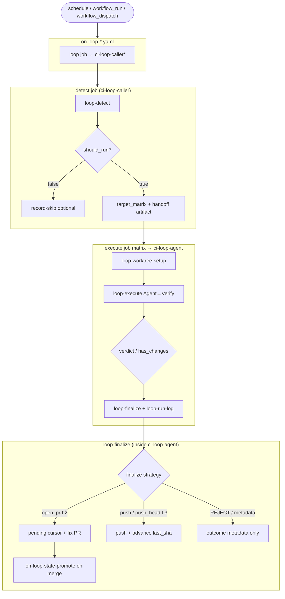
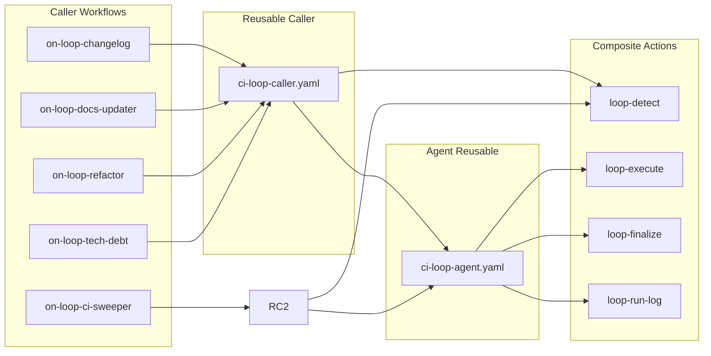

# Loop Engineering Design

This document describes the design philosophy, architecture, and design principles of Loop Engineering.
For concrete specifications (Actions/Workflows list, interfaces), see [Specification](../../reference/specification.md).

## Implementation Status

| Loop (`loop_name`)  | Skill (`common`) | Status                             | Level         |
| ------------------- | ---------------- | ---------------------------------- | ------------- |
| `docs-updater`       | `docs-updater`   | Dogfood L2; multi-branch on `main` | L2 (Assisted) |
| `ci-sweeper`        | `ci-sweeper`     | Dogfood L2; integration + PR heads | L2 (Assisted) |
| `changelog`         | `changelog`      | Dogfood L2; weekly schedule        | L2 (Assisted) |
| `refactor`          | `refactor`       | Dogfood L2; weekly schedule        | L2 (Assisted) |
| `tech-debt`         | `tech-debt`      | Dogfood L2; weekly report PR       | L2 (Assisted) |
| `issue-triage`      | `issue-triage`   | Dogfood L1 / in progress           | L1 (Observe)  |
| `issue-autofix`     | `issue-autofix`  | Dogfood L2 / in progress           | L2 (Assisted) |
| `pr-revise`         | `pr-revise`      | Dogfood L2 / in progress           | L2 (Assisted) |
| `loop-stale-pr`     | —                | Not started                        | -             |

Platform actions (`loop-detect` `target_matrix`, handoff artifact, `domain_persistence_script`, merge-gated `pending`) are implemented — see [Multi-Branch Loops Design](multi-branch-loops-design.md).

## Loop Candidate Roadmap

Referencing the design philosophy of GitHub Agentic Workflows ([official blog](https://github.blog/ai-and-ml/automate-repository-tasks-with-github-agentic-workflows/), [Self-Healing CI case study](https://pascoal.net/2026/03/12/self-healing-ci-using-gh-aw/)), the following loops are under consideration.

### Tier 1 (High Priority — Implementable with Existing Infrastructure)

| Loop                             | Detection Method                                    | Agent Behavior                    | Expected Level                                                                                  |
| -------------------------------- | --------------------------------------------------- | --------------------------------- | ----------------------------------------------------------------------------------------------- |
| **docs-updater** | git diff: doc drift facts on integration branches   | Triage stale docs; open fix PR    | L2 — see [Docs Updater Workflow](workflows/loop-docs-updater-workflow-design.md)                  |
| **ci-sweeper**                   | GitHub API: failed runs (integration + optional PR) | Auto-fix; PR or push per mode     | L2 default; L3 opt-in — see [CI Sweeper Workflow](workflows/loop-ci-sweeper-workflow-design.md) |
| **changelog**                    | git log: parse conventional commits                 | Auto-generate/update CHANGELOG.md | L2 — see [Changelog Workflow](workflows/loop-changelog-workflow-design.md)                      |
| **refactor**                     | repo scan: duplication_block / oversized_unit hints | O1/O2 structural fix; open PR     | L2 — see [Refactor Workflow](workflows/loop-refactor-workflow-design.md)                        |
| **tech-debt**                    | full-repo mechanical debt sensors                   | Classify + write dated report PR  | L2 — see [Report Tech Debt Workflow](workflows/loop-tech-debt-workflow-design.md)               |

#### CI failure repair — one package, layered responsibilities

`ci-sweeper` stays **one loop** (one detect script, one entry skill, one caller). CI failure repair does not split into stack-specific loop packages. Routing and defer rules split across detect facts, entry skill references, and caller config.

See also [Ubiquitous Language](CONTEXT.md) and [Detect Script Output](#detect-script-output).

##### Detect script output

Every detect script emits a common envelope (see [Specification — Detect script output](../../reference/specification.md#detect-script-output-per-context)):

| Field              | Role                               |
| ------------------ | ---------------------------------- |
| `skip`             | No actionable work in this context |
| `result`           | Domain JSON (facts only)           |
| `verifier_context` | Optional markdown for verify       |

The `result` body is **observation-trigger-specific** — not one shared schema:

| Trigger family | Loop (`loop_name`) | Skill (`common`) | Example `result` fields                                  |
| -------------- | ------------------ | ---------------- | -------------------------------------------------------- |
| CI failure     | `ci-sweeper`       | `ci-sweeper`     | `failures[]`, `failure_type` hint, (future) `stack_hint` |
| Doc drift      | `docs-updater`      | `docs-updater`   | `changed_files`, `affected_docs`, …                      |
| Changelog      | `changelog`        | `changelog`      | `commits[]`, …                                           |
| Refactor hints | `refactor`         | `refactor`       | `hints[]` (`duplication_block`, `oversized_unit`)        |
| Tech debt      | `tech-debt`        | `tech-debt`      | `signals[]`, `hotspots[]`, `previous_report`             |

Semantic arrays such as `findings[]` are **Execute** output only — see [Semantic Findings](CONTEXT.md#language). Detect emits mechanical facts.

##### Execute — stack routing (A')

Distributable entry skills stay **repository-neutral**. Named domain skills (e.g. `github-actions-validation`, repo-specific sweepers) are **caller configuration** — not hardcoded in APM skill `references/`. Coupling belongs in the consumer caller YAML.

| Layer                            | Responsibility                                      | Example                                                                                  |
| -------------------------------- | --------------------------------------------------- | ---------------------------------------------------------------------------------------- |
| Detect                           | Mechanical facts                                    | `failures[]`, optional `stack_hint` from `workflow_name`                                 |
| Entry skill                      | Generic orchestration                               | Classify, read caller `## Instructions` for dispatch, fix one regression, report outcome |
| Caller `prompt_instructions`     | **Stack routing (A')** — named skills for this repo | `on-loop-ci-sweeper.yaml`: workflow → skill map                                          |
| Caller `agent_verifier_criteria` | Failure kind defer (B) appendix                     | REJECT coverage/deps fixes until domain skill exists                                     |

Platform prompt shape (`loop-detect` → `build_prompt_text`):

```text
Run the {skill_name} skill.
## Change Detection Result
{detect JSON}
## Instructions          ← caller prompt_instructions (routing + repo overlay)
## Constraints           ← level, allowlist
```

The agent reads entry skill workflow via SKILL.md; **named skill paths live in `## Instructions`**, not in distributable references.

##### Failure kind defer (B)

For failure kinds outside minimal CI repair (coverage threshold, dependency breakage):

| Layer                            | Responsibility                                                                           |
| -------------------------------- | ---------------------------------------------------------------------------------------- |
| Entry skill                      | Generic `DO NOT USE FOR`, checklist — classify Watch, no edit (no named consumer skills) |
| Caller `agent_verifier_criteria` | Appendix — REJECT diffs that address deferred kinds; may name expected domain skills     |

CI failure kinds outside minimal repair (coverage threshold, dependency breakage) stay in **`ci-sweeper`** — defer via [Failure kind defer (B)](#failure-kind-defer-b), optional domain skills in caller `prompt_instructions` / verifier appendix. No separate `loop-test-coverage` package.

### Tier 2 (Medium Priority — new observation triggers)

| Loop             | Observation trigger          | Agent Behavior                                 | Expected Level |
| ---------------- | ---------------------------- | ---------------------------------------------- | -------------- |
| **issue-triage** | GitHub API: unlabeled issues | Codebase analysis → label assignment + comment | L1 → L2        |
| **stale-pr**     | GitHub API: stale PRs        | Review comment or close suggestion             | L1             |

### Tier 3 (Low Priority — Complex Safety Measures)

| Loop                  | Observation trigger          | Agent Behavior                          | Expected Level   |
| --------------------- | ---------------------------- | --------------------------------------- | ---------------- |
| **security-advisory** | GitHub Advisory DB: new CVEs | Create PR for vulnerability remediation | L1 (report only) |
| **api-docs**          | OpenAPI spec diff (git diff) | API documentation sync                  | L2               |

**CI failure extensions (not new loops):** Renovate/bot PR handling and dependency-breakage repair are **caller filters** (`pr_include_bots`, `pr_exclude`) plus domain skills under `ci-sweeper` — see [CI Sweeper — dependency update](workflows/loop-ci-sweeper-workflow-design.md#dependency-update-caller-filter--domain-skill).

### Selection Criteria

Priority assessment when adding new loops:

1. **ROI**: Manual handling frequency × time per occurrence > loop construction cost
2. **Safety**: Is the file scope restrictable via allowlist?
3. **Verifiability**: Are there clear criteria that a verifier can evaluate?
4. **Graduated Promotion**: Promote to L2 only after 2+ weeks of stable operation at L1
5. **Trigger separation**: New loop packages need a distinct observation trigger (git diff, git log, GitHub API entity, CI failure sensor, …). Extending an existing trigger (e.g. coverage failure under CI) uses the same loop package + caller config — not a new `loop-*` name

### References

- [GitHub Agentic Workflows Official](https://docs.github.com/en/copilot/concepts/agents/about-github-agentic-workflows)
- [GitHub Blog: Automate repository tasks](https://github.blog/ai-and-ml/automate-repository-tasks-with-github-agentic-workflows/)
- [Self-Healing CI with GitHub Agentic Workflows](https://pascoal.net/2026/03/12/self-healing-ci-using-gh-aw/)
- [Transform Your SDLC with Agentic Workflows](https://colinsalmcorner.com/transform-sdlc-with-agentic-workflows/)

## Package Structure

Maintenance loop skills ship under `.apm/packages/common/.apm/skills/` (**Skill + detect script** per domain; optional ledger script). Shared actions stay domain-agnostic.

```text
.apm/packages/common/.apm/skills/
  docs-updater/
    SKILL.md
    scripts/detect_changes.sh
  ci-sweeper/
    SKILL.md
    scripts/detect_ci_failures.sh
    scripts/update_run_ledger.sh
  changelog/
    SKILL.md
    scripts/detect_changelog_commits.sh
  refactor/
    SKILL.md
    scripts/detect_refactor.sh
  tech-debt/
    SKILL.md
    scripts/detect_tech_debt.sh
```

Callers reference installed paths (e.g. `.agents/skills/<skill-name>/scripts/...`). Workflow filenames remain `on-loop-<loop_name>.yaml`.

Hook/manual and loop skills live under `.apm/packages/common/.apm/skills/` — see [Loop Skill Consolidation Design](../../superpowers/specs/2026-07-21-loop-skill-consolidation-design.md).

## Naming Conventions

| Identifier type | Naming pattern             | Example                                               |
| --------------- | -------------------------- | ----------------------------------------------------- |
| Workflow file   | `on-loop-<loop_name>.yaml` | `on-loop-docs-updater.yaml`                            |
| `loop_name`     | kebab-case (state key)     | `docs-updater`, `ci-sweeper`, `changelog`, `tech-debt` |
| Skill directory | kebab-case (no `loop-`)    | `docs-updater`, `ci-sweeper`, `refactor`, `tech-debt` |

## docs-updater (Docs Update Loop)

| Component                                                                 | Description                                                            |
| ------------------------------------------------------------------------- | ---------------------------------------------------------------------- |
| `.apm/packages/common/.apm/skills/docs-updater/SKILL.md`                  | Hook/manual + automation triage; automation path uses `findings[]`     |
| `.apm/packages/common/.apm/skills/docs-updater/scripts/detect_changes.sh` | Per-branch doc drift facts (`changed_files`, `affected_docs`)          |
| `eval.yaml` + `evals/tasks/`                                              | waza evaluation suite (interactive + automation paths)                 |

## ci-sweeper (CI Sweeper)

| Component                                                                   | Description                                               |
| --------------------------------------------------------------------------- | --------------------------------------------------------- |
| `.apm/packages/common/.apm/skills/ci-sweeper/SKILL.md`                      | Fix / Watch / Escalate classification + minimal CI repair |
| `.apm/packages/common/.apm/skills/ci-sweeper/scripts/detect_ci_failures.sh` | Failed run detection (stable filters only)                |
| `.apm/packages/common/.apm/skills/ci-sweeper/scripts/update_run_ledger.sh`  | `domain_persistence_script` target for finalize           |

For caller inputs and behavior, see [CI Sweeper Workflow Design](workflows/loop-ci-sweeper-workflow-design.md).

## changelog (Changelog Maintenance)

| Component                                                                        | Description                                             |
| -------------------------------------------------------------------------------- | ------------------------------------------------------- |
| `.apm/packages/common/.apm/skills/changelog/SKILL.md`                            | Keep a Changelog editing from conventional commit facts |
| `.apm/packages/common/.apm/skills/changelog/scripts/detect_changelog_commits.sh` | Per-branch conventional commit facts (`commits[]`)      |
| `eval.yaml` + `evals/tasks/`                                                     | waza evaluation suite                                   |

For caller inputs and behavior, see [Changelog Workflow Design](workflows/loop-changelog-workflow-design.md).

## refactor (Structural Refactor)

| Component                                                              | Description                                              |
| ---------------------------------------------------------------------- | -------------------------------------------------------- |
| `.apm/packages/common/.apm/skills/refactor/SKILL.md`                   | Interactive + loop structural O1/O2 apply                |
| `.apm/packages/common/.apm/skills/refactor/scripts/detect_refactor.sh` | Mechanical hints (`duplication_block`, `oversized_unit`) |

For caller inputs and behavior, see [Refactor Workflow Design](workflows/loop-refactor-workflow-design.md).

## tech-debt (Technical Debt Report)

| Component                                                                | Description                                                          |
| ------------------------------------------------------------------------ | -------------------------------------------------------------------- |
| `.apm/packages/common/.apm/skills/tech-debt/SKILL.md`                    | Classify mechanical debt signals; write dated report under allowlist |
| `.apm/packages/common/.apm/skills/tech-debt/scripts/detect_tech_debt.sh` | Full-repo sensors (`signals[]`, `hotspots[]`)                        |
| `eval.yaml` + `evals/tasks/`                                             | waza evaluation suite                                                |

For caller inputs and behavior, see [Report Tech Debt Workflow Design](workflows/loop-tech-debt-workflow-design.md).

## Execution Flow

```text
trigger → on-loop-<name>.yaml (thin caller: with: + secrets:)
  loop job → ci-loop-caller*.yaml
    detect job:
      → loop-detect                    # branch/PR enumeration, checkout per context, detect_script
      → outputs: target_matrix (slim), handoff_artifact_name, should_run, skip_reason
    execute job (matrix per target):
      → ci-loop-agent.yaml             # worktree from target.from; verifier_context always wired
        → loop-execute (Agent→Verify)
        → loop-finalize (when finalize_enabled)   # NOT a separate caller matrix job
        → loop-run-log / loop-notify-pr (siblings)
    record-skip job (when budget | circuit_breaker):
      → loop-run-log
```

Job graph detail: [Loop Caller Workflows Design](loop-caller-workflows-design.md). Reusable caller profiles: [Loop Caller Reusable Workflow Design](loop-caller-reusable-design.md#detect-permissions-profile).

### Workflow Architecture Diagram


```mermaid
flowchart TD
    trigger([schedule / workflow_run / workflow_dispatch]) --> caller

    subgraph caller["on-loop-*.yaml"]
        direction TB
        C1[loop job → ci-loop-caller*]
    end

    C1 --> detect

    subgraph detect["detect job (ci-loop-caller)"]
        direction TB
        D1[loop-detect] --> D2{should_run?}
        D2 -->|false| D_SKIP[record-skip optional]
        D2 -->|true| D3[target_matrix + handoff artifact]
    end

    D3 --> execute
    subgraph execute["execute job matrix → ci-loop-agent"]
        direction TB
        A1[loop-worktree-setup] --> A2[loop-execute Agent→Verify]
        A2 --> A3{verdict / has_changes}
        A3 --> F1[loop-finalize + loop-run-log]
    end

    subgraph finalize_inside["loop-finalize (inside ci-loop-agent)"]
        direction TB
        F1 --> F_STRAT{finalize strategy}
        F_STRAT -->|open_pr L2| F_PENDING[pending cursor + fix PR]
        F_STRAT -->|push / push_head L3| F_PUSH[push + advance last_sha]
        F_STRAT -->|REJECT / metadata| F_META[outcome metadata only]
        F_PENDING --> F_PROMOTE[on-loop-state-promote on merge]
    end
```

### Component Structure Diagram


```mermaid
graph LR
    subgraph callers["Caller Workflows"]
        CW1[on-loop-changelog]
        CW2[on-loop-docs-updater]
        CW3[on-loop-ci-sweeper]
        CW4[on-loop-refactor]
        CW5[on-loop-tech-debt]
    end

    subgraph caller_reusable["Reusable Caller"]
        RC1[ci-loop-caller.yaml]
    end

    subgraph agent_reusable["Agent Reusable"]
        RW1[ci-loop-agent.yaml]
    end

    subgraph actions["Composite Actions"]
        CA0[loop-detect]
        CA2[loop-execute]
        CA3[loop-finalize]
        CA10[loop-run-log]
    end

    CW1 --> RC1
    CW2 --> RC1
    CW4 --> RC1
    CW5 --> RC1
    CW3 --> RC2
    RC1 --> CA0
    RC2 --> CA0
    RC1 --> RW1
    RC2 --> RW1
    RW1 --> CA2
    RW1 --> CA3
    RW1 --> CA10
```

## STATE Files

State and observability files under `.loop/` (multi-loop coordination principle). Per-loop state is JSON; the shared run log is JSONL in a markdown file.

```text
.loop/
  state-docs-updater.json    ← owned by docs-updater
  state-ci-sweeper.json     ← owned by ci-sweeper
  state-changelog.json      ← owned by changelog
  state-refactor.json       ← owned by refactor
  state-tech-debt.json      ← owned by tech-debt
  loop-budget.json          ← per-loop daily run/token caps (read by loop-detect)
  loop-run-log.md           ← shared JSONL run history (append via loop-run-log; 30-day prune)
  .gitkeep
```

[… truncated at ~4148 of 11830 tokens — use ctx_read with lines= parameter to see specific sections]
