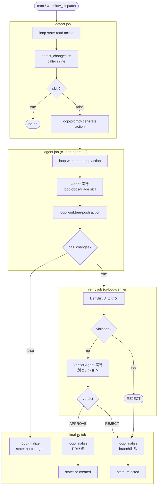
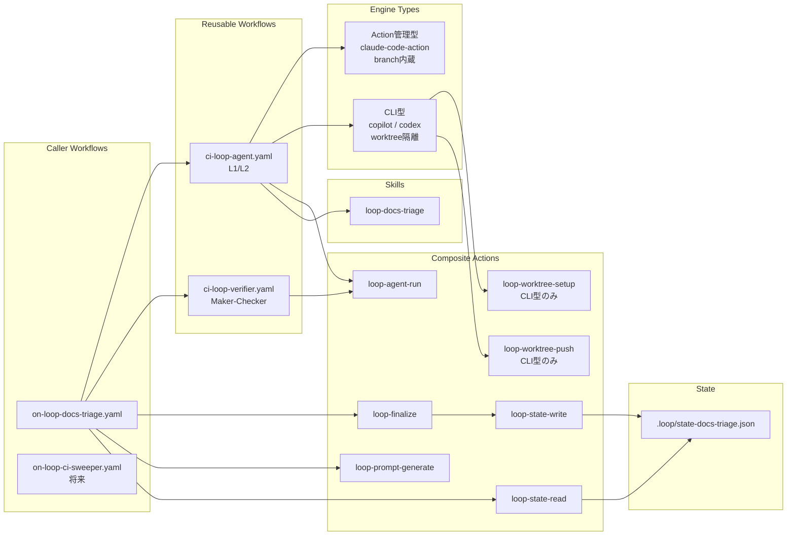

# Loop Engineering Design

ループパッケージのアーキテクチャと設計方針を定義する。
動作確認完了後に [Specification](specification.md) への統合を検討する。

## 実装状況

| パッケージ | ステータス | レベル |
|-----------|-----------|--------|
| `docs-loop` | ✅ 実装済み | L2 (Assisted) |
| `ci-sweeper-loop` | 未着手 | - |
| `changelog-loop` | 未着手 | - |
| `issue-triage-loop` | 未着手 | - |
| `test-coverage-loop` | 未着手 | - |
| `stale-pr-loop` | 未着手 | - |

## ループ候補ロードマップ

GitHub Agentic Workflows（[公式ブログ](https://github.blog/ai-and-ml/automate-repository-tasks-with-github-agentic-workflows/)、[Self-Healing CI 事例](https://pascoal.net/2026/03/12/self-healing-ci-using-gh-aw/)）の設計思想を参考に、以下のループを検討する。

### Tier 1（高優先度 — 既存基盤で実装可能）

| ループ | 検出方法 | Agent 動作 | 想定レベル |
|--------|----------|-----------|-----------|
| **ci-sweeper** | GitHub API: 失敗した workflow runs を取得 | lint/build エラーの自動修正、PR 作成 | L2 → L3 |
| **changelog** | git log: conventional commits を解析 | CHANGELOG.md 自動生成/更新 | L2 |

### Tier 2（中優先度 — 追加 detect action が必要）

| ループ | 検出方法 | Agent 動作 | 想定レベル |
|--------|----------|-----------|-----------|
| **issue-triage** | GitHub API: ラベルなし issue を取得 | コードベース分析→ラベル付与+コメント | L1 → L2 |
| **stale-pr** | GitHub API: 7日以上更新なし PR を取得 | レビューコメント or close 提案 | L1 |
| **test-coverage** | CI artifacts: カバレッジレポート解析 | 不足テストの自動生成、PR 作成 | L2 |

### Tier 3（低優先度 — 安全策が複雑）

| ループ | 検出方法 | Agent 動作 | 想定レベル |
|--------|----------|-----------|-----------|
| **dependency-update** | Renovate PR の CI 失敗を検出 | 依存更新による破壊の自動修正 | L2 |
| **security-advisory** | GitHub Advisory DB: 新規 CVE | 脆弱性対応の PR 作成 | L1 (報告のみ) |
| **api-docs** | OpenAPI spec 差分検出 | API ドキュメント同期 | L2 |

### 選定基準

新ループを追加する際の優先度判定：

1. **ROI**: 手動対応の頻度 × 1回あたりの時間 > ループ構築コスト
2. **安全性**: allowlist で制限できるファイルスコープか
3. **検証可能性**: verifier が判断できる明確な基準があるか
4. **段階的昇格**: L1 で2週間以上安定稼働してから L2 に昇格

### 参考資料

- [GitHub Agentic Workflows 公式](https://docs.github.com/en/copilot/concepts/agents/about-github-agentic-workflows)
- [GitHub Blog: Automate repository tasks](https://github.blog/ai-and-ml/automate-repository-tasks-with-github-agentic-workflows/)
- [Self-Healing CI with GitHub Agentic Workflows](https://pascoal.net/2026/03/12/self-healing-ci-using-gh-aw/)
- [Transform Your SDLC with Agentic Workflows](https://colinsalmcorner.com/transform-sdlc-with-agentic-workflows/)

## パッケージ構成

```text
.apm/packages/
  docs-loop/             ← docs更新ループ（自己完結）
  ci-sweeper-loop/       ← 将来: CI失敗修正ループ
  changelog-loop/        ← 将来: changelog起草ループ
```

## 命名規約

| パッケージ種別 | 命名パターン | 例 |
|---------------|-------------|-----|
| ドメイン固有ループ | `<domain>-loop` | `docs-loop`, `ci-sweeper-loop` |

## 依存関係

各 `*-loop` パッケージは自己完結（他パッケージへの依存なし）。
APM パッケージは Skill のみ提供し、Workflow/Action は配布しない。

## docs-loop（docs更新ループ）

| コンポーネント | 内容 |
|-------------|------|
| `.apm/skills/loop-docs-triage/SKILL.md` | triage findings に基づきドキュメント編集を行うスキル |
| `eval.yaml` + `evals/tasks/` | waza 評価スイート |

## 共通 Actions（`.github/actions/`）

| Action | 内容 |
|--------|------|
| `loop-agent-run` | 全エンジン統一の agent 実行（install + run）。Claude は action 内蔵、CLI は npx |
| `loop-finalize` | PR 作成 / branch 削除 / state 更新を一括実行 |
| `loop-prompt-generate` | skill_name + context → prompt テキスト生成 |
| `loop-state-read` | checkout + state JSON read（outputs: last_sha, current_sha） |
| `loop-state-write` | state JSON write + commit/push（リトライ付き） |
| `loop-worktree-setup` | CLI型 L2用: 隔離 worktree + branch 作成 |
| `loop-worktree-push` | CLI型 L2用: worktree の変更を commit/push + cleanup |

## 共通 Reusable Workflow

| Workflow | 内容 |
|----------|------|
| `ci-loop-agent.yaml` | engine input (claude/copilot) で切替可能な agent 実行。L1/L2 対応 |
| `ci-loop-verifier.yaml` | Maker-Checker 分離用の verifier 実行。denylist チェック + agent 検証 |

## 実行フロー

```text
cron → on-loop-docs-triage.yaml
  detect job:
    → loop-state-read action              # 前回SHA取得
    → detect_changes.sh (inline)          # docs影響検出（caller固有）
    → loop-prompt-generate action         # prompt組み立て
  agent job:
    → ci-loop-agent.yaml (reusable)       # Agent実行
      → loop-agent-run action             # 全エンジン統一実行
      (CLI型の場合: worktree-setup → agent → worktree-push)
  verify job:
    → ci-loop-verifier.yaml (reusable)    # Maker-Checker分離
      → denylist チェック                  # パス違反は即REJECT
      → loop-agent-run action             # verifier agent 実行
  finalize job:
    → loop-finalize action                # PR作成 or branch削除 + state更新
```

### ワークフローアーキテクチャ図



### コンポーネント構成図



## STATE ファイル

状態ファイルはループごとに個別に持つ（multi-loop協調原則）。JSON形式。

```text
.loop/
  state-docs-triage.json    ← docs-loop が所有
  state-ci-sweeper.json     ← 将来: ci-sweeper-loop が所有
  state-changelog.json      ← 将来: changelog-loop が所有
  .gitkeep
```

- State の読み書きは `loop-state-read` / `loop-state-write` action が担当
- `.gitattributes` で `merge=ours` を設定し、マージ競合を防止
- 初回は state ファイル不在でも `loop-state-read` がデフォルト値（HEAD~10）を返す

## L2 昇格要件

| 要件 | 対応方針 | ステータス |
|------|----------|-----------|
| loop-budget スキル | npm/GitHub Release からキャッシュ付きダウンロード（リポジトリ非依存） | 将来対応 |
| loop-verifier スキル | 同上 | 将来対応 |
| Maker-Checker 分離 | ci-loop-verifier.yaml として実装 | ✅ 実装済み |
| Worktree 隔離 | loop-worktree-setup/push action + ci-loop-agent L2 mode | ✅ 実装済み |
| Denylist / Allowlist | SKILL.md 内で定義、verifier がチェック | ✅ 実装済み |

## 設計方針

### コンポーネント設計原則

| 種別 | 配置場所 | 原則 |
|------|----------|------|
| Reusable Workflow | `.github/workflows/ci-loop-*.yaml` | 汎用ロジックのみ。ドメイン固有の判定基準は caller から input で渡す |
| Composite Action | `.github/actions/loop-*` | 汎用ステップの集約。特定スクリプトやリポジトリ固有パスに依存してはならない |
| Caller Workflow | `.github/workflows/on-loop-*.yaml` | ドメイン固有ロジック（検出スクリプト呼び出し、判定基準定義）はここに記述 |
| APM Package | `.apm/packages/*-loop/` | Agent 向け Skill のみ配布。Workflow や Action は配布しない |
| Skill | `.apm/packages/*-loop/.apm/skills/` | Agent の行動制約を定義。外部スキルを参照しない（自己完結） |

**判断基準**: 「他のリポジトリが remote 参照して使えるか？」が YES なら action/workflow に入れる。NO（特定パスやスクリプトに依存）なら caller にインラインで書く。

### Maker-Checker 分離（最重要原則）

実装エージェント（Maker/Implementer）と検証エージェント（Checker/Verifier）は必ず別エージェントセッションにする。同一エージェントが自分の出力を検証すると確証バイアスが発生し、エラーを見逃す。

Verifier の設計原則:

- デフォルトの姿勢を「拒否」とする（承認ではなく拒否する理由を探す）
- プロンプトに CI テスト出力と lint 結果を必須入力として含める
- モデルは実装エージェントより強力なもの、または別系統のものを使う
- `/goal` の stop condition 評価も fresh model で行う（実装者と同一モデルにしない）

### 停止条件を先に設計する

ループの作成より先に、ループの停止方法を設計する。停止条件なしに L3 を起動してはならない。

3段階の停止レベル:

| レベル | トリガー例 |
|--------|-----------|
| Slow Down（減速） | トークン予算が80%超 / false positive 30%超 |
| Pause（一時停止） | 本番インシデント発生中 / スキーママイグレーション |
| Kill（完全停止） | S2以上障害が2回連続 / 2週連続コスト対価値逆転 |

### 段階的自律（L1 → L2 → L3 の昇格ルール）

新しいパターンは必ず L1 から開始する。既存ループが L3 でも、新機能は L1 から。

| ティア | 内容 | 維持期間目安 |
|--------|------|-------------|
| L1（Report） | STATE.md 更新のみ。コード変更なし | 1-2週間 |
| L2（Assisted） | worktree修正 + verifier承認時のみPR作成。auto-mergeはpath allowlist限定 | 安定後にL3検討 |
| L3（Unattended） | denylist + 予算上限 + metrics + 人手ゲートが全て確立済みの場合のみ | 条件達成後のみ |

L1 → L2 移行チェックリスト:

- state file スキーマが文書化されている
- SKILL.md に build / test コマンドが記載されている
- 実装者と検証者が別セッションになっている
- denylist に auth・payments・secrets・インフラが明記されている
- auto-merge 可能なパスを allowlist で制限している
- 日次トークン上限と最大サブエージェント数が設定されている

### トークン予算管理

トークンコストは会話の蓄積により二次関数的に増大する傾向がある。

コスト圧縮パターン:

| パターン | トークン削減率（参考値） |
|----------|------------------------|
| スコープ限定（サブエージェント分離） | 約40% |
| コーディネーター/スペシャリスト分離 | 約54% |
| 文脈トリミング（10-15呼び出しごと） | 約23% |
| Prompt caching（固定系プロンプト） | 固定部のみ最大90% |

設計上の対策:

- 安価なモデルで triage パスを実行し、アクション対象がある場合のみ強力なモデルを起動
- アイテムが空のウォッチリストに対しては早期終了（コスト削減の最大機会）
- phase 境界（triage → fix → verify）でコンテキストリセット
- 日次上限を設定し、80%到達で一時停止

### Worktree 隔離

L2 以上で自動修正を行う場合、ブランチ隔離が必須。エンジンの種類により実現方法が異なる。

**エンジン戦略の分類:**

| 戦略 | エンジン | ブランチ管理 | 作業ディレクトリ |
|------|----------|-------------|----------------|
| Action管理型 | claude-code-action | action が内部で branch 作成・commit・push | GITHUB_WORKSPACE 固定 |
| CLI型 | copilot, codex, claude-cli | worktree-setup/push action で外部管理 | worktree パスで隔離 |

**統一 contract**: どちらの戦略でも `ci-loop-agent.yaml` は `{ branch, has_changes }` を output する。verifier 以降のフローは全エンジン共通。

**CLI型の原則:**

- 1アイテム = 1 worktree
- verifier が REJECT した場合は branch 削除で全変更破棄
- タスク完了後に worktree を削除

**新エンジン追加時の手順:**

1. Action管理型: L2 job を個別追加、output で branch_name を取得
2. CLI型: `agent-cli-l2` job の case 文にエンジンを追加するだけ

### Denylist / 最小権限

MCP コネクターとファイル変更は最小権限の原則に基づく。

```yaml
# Path denylist（全ループ共有）
path_denylist:
  - "**/.env"
  - "**/credentials*"
  - "**/secrets*"
  - "**/migration/*.sql"
  - "**/infrastructure/**"
```

段階別の権限:

| ティア | 許可範囲 |
|--------|---------|
| L1 | Read-only。PRコメントへの書き込みのみ |
| L2 | 承認済みpathへの limited write。branch作成許可 |
| L3 | allowlist内パスへの write。auto-mergeはallowlist必須 |

### Multi-loop 協調

複数ループが同一リポジトリを操作する場合の5原則:

1. **ブランチ排他所有**: 1ブランチにつき同時に操作できるループは1つのみ
2. **状態ファイル分離**: 各ループは専用の状態ファイルを持つ（`state-triage.md` / `state-pr-watcher.md`）
3. **役割分離**: Triage ループは L1 でレポートのみ。Action ループは独立実行
4. **統一 denylist**: 全ループが同一の path denylist を共有
5. **予算合算管理**: 全ループのトークン消費を合算して日次予算上限を管理

衝突検出は各 Action ループが実行前にピア状態ファイルの `acting_on` フィールドを確認して行う。

### Failure Mode への対策

| 症状 | 原因 | 対処 |
|------|------|------|
| 同一PRに5回以上自動修正 | Verifier が弱い（Infinite Fix Loop） | リトライ上限3回。強力なモデルでVerifier置換 |
| CIが通らないのにVerifier承認 | テスト実行省略（Verifier Theater） | 「拒否理由を探す」フレーミング。テスト出力必須化 |
| STATE.mdにクローズ済み増殖 | pruningなし（State Rot） | 実行ごとにクローズ済み削除。ループごとにファイル分離 |
| 変更意図がチームに理解されない | auto-merge拡大（Comprehension Debt Spiral） | 週次ダイジェスト義務化。medium-riskは人手ゲートへ |
| コンテキスト肥大で品質劣化 | 会話履歴無制限蓄積（Context Rot） | phase境界でリセット。10-15呼び出しごとにトリミング |
