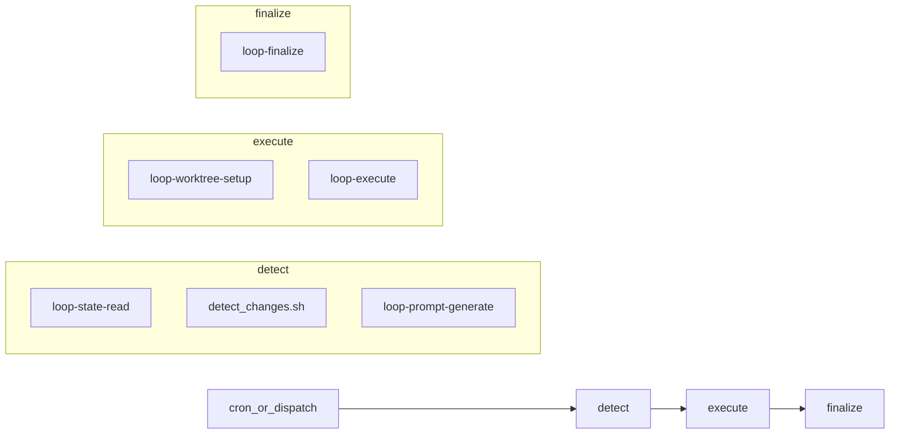
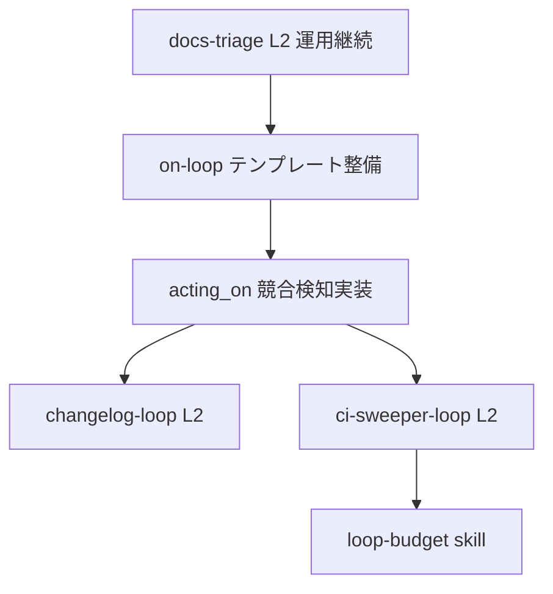
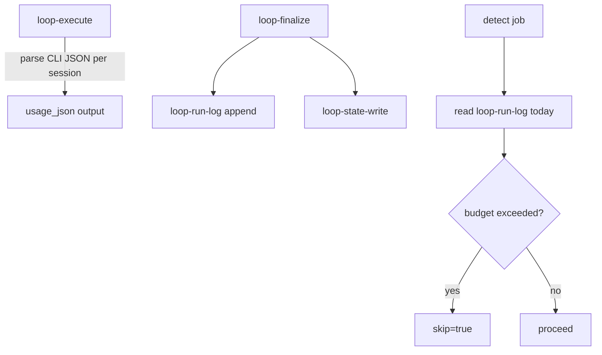

# Loop Workflow レビュー判断

> **別セッション再開**: [loop-workflow-review-resume.md](loop-workflow-review-resume.md)

## 総合判断

| 観点 | 判断 |
|------|------|
| **docs-triage 単体（L2）** | Loop Engineering 原則に適合。本番運用可 |
| **転用性（アーキテクチャ）** | `ci-loop-agent` + `loop-*` actions のハブ＆スポーク設計は意図どおり転用可能 |
| **横展開の即時可否** | 2つ目以降のループ（特に `ci-sweeper`）は、いくつかの未実装ギャップを先に埋める必要あり |
| **外部レビュー全体** | 方向性はおおむね妥当。ただし過大評価・設計意図の見落とし・既存対策の未認識あり |

---

## 1. Loop Engineering としての評価（実装ベース）

### 適合している点（外部レビューも正しい）

[`on-loop-docs-triage.yaml`](../../.github/workflows/on-loop-docs-triage.yaml) は [Loop Engineering Design](../explanation/loop-engineering-design.md) および [Checklist](loop-engineering-checklist.md) の契約に沿っている。



| 原則 | 実装 |
|------|------|
| Detect → Execute → Finalize 分離 | 3 jobs、状態は Finalize のみ更新 |
| Maker-Checker 分離 | [`loop-execute`](../../.github/actions/loop-execute/action.yml) で implementer / verifier を別セッション実行 |
| サーキットブレーカー | `consecutive_failures >= 3` で `paused=true`, `skip=true` |
| Worktree 隔離 | `loop-worktree-setup` → 専用ブランチで commit/push |
| 構造化 Verifier 出力 | `PROMPT_VERIFIER_OUTPUT_CONTRACT` + `open_rejections` 永続化 |
| パスガードレール | allowlist/denylist の**決定論的チェック**が LLM verifier より前に実行（外部レビューが見落とし） |
| 並行制御 | `concurrency.group: loop-docs-triage` |
| コスト抑制 | `schedule`（平日 9:00）+ `workflow_dispatch` のみ。`on: push` ではない |

docs-triage 固有の適切な設定:

- `no_changes_verdict: REJECT` — 変更なしは不合格（ドキュメント修正タスクとして正しい）
- `infer_files_pattern` — `.md|.yml|.yaml` に限定
- `LOOP_NAME: docs-triage` — state は `.loop/state-docs-triage.json` に自動解決（`loop-detect`）

### 外部レビューが過大評価した点

- **「教科書通り・理想的」** — 設計ドキュメント上、以下は **Future / Not started**:
  - `loop-budget` / `loop-verifier` skill
  - `acting_on` によるマルチループ競合検知（設計に記載あるが**未実装**）
  - `ci-sweeper-loop`, `changelog-loop` 等の横展開先
- **L2 で main ブランチ保護と競合** — L2 は worktree ブランチへの push のみ。main 直書きはしない（Design Invariant #1）。ブランチ保護の主な論点は **L3 auto-merge** 時の Required Checks

### 外部レビューが設計意図を誤解した点

**「Hard Gate（テスト強制）を loop-execute に組み込むべき」**

Checklist は明確に分離している:

> Verifier: Does not evaluate lint/CI concerns (that is CI's job)  
> Skill: Does not guarantee CI passing (that is CI's job)

つまり **全ループに loop-execute 内 Hard Gate を強制するのは現設計と矛盾**。  
コード修正ループ（`ci-sweeper`）では **caller 側の追加ステップ** または **オプション input** として導入するのが正しい拡張方針。

---

## 2. 転用性評価

### 転用できる（外部レビュー妥当）

[`ci-loop-agent.yaml`](../../.github/workflows/ci-loop-agent.yaml) は汎用エンジン。新ループ追加時に caller が差し替えるのは主に:

1. **Detect** — 検知スクリプト（caller inline が原則）
2. **プロンプト / criteria** — `prompt_text` or `prompt_file`, `agent_verifier_criteria`
3. **スコープ** — `allowlist`, `denylist`, `infer_files_pattern`
4. **メタデータ** — `STATE_FILE`, `SKILL_NAME`, `concurrency.group`

設計ドキュメントのロードマップ（Tier 1: `ci-sweeper`, `changelog`）も同じパターンを想定している。

### 転用時に必ずカスタマイズが必要な箇所

| 項目 | docs-triage の例 | 転用時 |
|------|------------------|--------|
| `DETECT_SCRIPT` | `docs-updater/scripts/detect_changes.sh` | ドメイン別スクリプト |
| `STATE_FILE` | `.loop/state-docs-triage.json` | `.loop/state-<domain>.json` |
| `AGENT_VERIFIER_CRITERIA` | ドキュメント品質基準 | タスク別基準 |
| `allowlist` | `docs/**/*.md,...` | `src/**` 等 |
| `no_changes_verdict` | `REJECT` | タスク依存（報告のみ L1 なら `APPROVE` も可） |
| Trigger | schedule | タスクに応じて schedule / dispatch / API トリガー |

### 既に存在するが docs-triage が未活用の転用機能

- **`prompt_file`** — プロンプト外部ファイル化（外部レビューの対策案は**既に input として存在**）
- **`verifier_context`** — CI ログ等の注入（コードループ向け。docs-triage では未使用で妥当）

---

## 3. 外部レビュー指摘の妥当性と採用判断

### 採用すべき（横展開前に優先）

| # | 指摘 | 妥当性 | 採用方針 |
|---|------|--------|----------|
| 1 | プロンプト YAML 肥大化 | 妥当 | 新ループは `prompt_file` + `.github/prompts/<loop>/` を標準化。docs-triage は動作中なので急ぎのリファクタ不要 |
| 2 | Hard Gate 不足（コード系） | 妥当（ci-sweeper 向け） | `ci-sweeper` では detect 後に lint/test 実行 → 結果を `verifier_context` に渡す **加えて**、caller 側または `verify_command` オプションで exit code ゲートを追加 |
| 3 | マルチループ競合 | 部分妥当 | ループ単位 `concurrency` は**既にある**。不足は設計ドキュメント記載の `acting_on` ピア状態チェック（**未実装**）と、必要なら repo 単位シリアライズ |
| 5 | ランナー / コスト暴走 | 妥当（一般論） | docs-triage は既に schedule 運用。新ループは G-02（トリガー限定）を必須化 |
| 6 | loop-execute 変更の波及 | 妥当 | SHA pin は既存（`@6aaff31f... # v1.7.8`）。加えて composite action の契約テスト（JSON parse, allowlist/denylist）を CI に追加 |
| 7 | Bash JSON パース脆弱性 | 妥当 | `extract_last_json_fence` が主、`tail -30` は fallback。パース失敗時は REJECT（安全側）だが false negative リトライあり。テスト追加＋中長期で TS 化を検討 |
| 8 | マルチエンジン CLI 保守 | 妥当 | `cli_version` pin を caller で明示。engine 追加時は `loop-install-cli` 契約テスト |
| 9 | モノレポ path 問題 | 妥当（将来） | `worktree_path` はあるが diff 基準は repo root。モノレポ展開時は `working_directory` / path prefix input の追加を検討 |

### 条件付き採用

| # | 指摘 | 判断 |
|---|------|------|
| 4 | denylist 柔軟性 vs 安全性 | 現状の中央デフォルト denylist は維持。インフラ修正ループは**別 workflow テンプレート**（denylist 緩和ではなくドメイン分離）で対応 |
| 10 | TypeScript 移行 | 中長期の技術的負債解消として妥当。docs-triage 本番や 2 ループ目のブロッカーではない |
| 11 | Branch protection | L3 のみ顕在化。L3 昇格チェックリスト（Required Status Checks）に既に記載 — ドキュメント強化で足りる |

### 採用しない / 修正して採用

| 指摘 | 理由 |
|------|------|
| 全ループに loop-execute 内 test gate 必須化 | 現設計の Verifier / CI 責務分離と矛盾 |
| denylist の caller 自由上書き | セキュリティホールリスク。ドメイン別テンプレートで代替 |
| 「100% 転用可能・完璧」という評価をそのまま受け入れる | `acting_on`, `loop-budget`, 横展開先パッケージは未実装 |

---

## 4. docs-triage 固有の軽微な改善候補（任意）

外部レビューでは未指摘だが、コード確認で見つかった点:

- **Detect スクリプトパス**: `docs-updater/scripts/detect_changes.sh` を使用しつつ `SKILL_NAME: loop-docs-triage` — 意図的共有なら README に明記、そうでなければ `loop-docs-triage` 配下へ移動
- **`verifier_context` 未使用** — docs タスクでは問題なし
- **L3 未使用** — L2 で正しい（Graduated Autonomy）

---

## 5. 横展開ロードマップ（推奨順序）



| Phase | 内容 | 根拠 |
|-------|------|------|
| **Phase 0** | docs-triage 運用・メトリクス収集（Approval Rate, consecutive_failures） | L2→L3 昇格ゲートの前提 |
| **Phase 0b** | `loop-run-log.md` 追記（outcome, duration, workflow_run, tokens_estimate） | [loop-run-log](https://github.com/cobusgreyling/loop-engineering/blob/main/loop-run-log.md) 相当。実測なしで開始可 |
| **Phase 1** | `on-loop-*.yaml` スキャフォールド + `prompt_file` 標準化 | 指摘 #1 対策。既存 input を活用 |
| **Phase 1c** | `loop-execute` で cursor CLI から model/tokens 実測 | コスト可視化の核心 |
| **Phase 2** | `acting_on` ピア状態チェック実装（[`loop-state-read`](../../.github/actions/loop-state-read/action.yml) 拡張） | 設計ドキュメント記載の未実装ギャップ |
| **Phase 2b** | `loop-budget` 日次上限 + detect 予算チェック | [loop-budget](https://github.com/cobusgreyling/loop-engineering/blob/main/loop-budget.md) 相当 |
| **Phase 3a** | `changelog-loop` — allowlist=`CHANGELOG.md`, Hard Gate 不要 | Tier 1, docs-triage と類似 |
| **Phase 3b** | `ci-sweeper-loop` — Hard Gate + `verifier_context` 必須 | Tier 1 だがコード変更。設計上の最大リスク |
| **Phase 4** | `loop-execute` 契約テスト、必要なら `verify_command` input | 指摘 #2, #6, #7 |
| **Phase 5** | `loop-budget` skill、TS 移行検討 | 設計 Future 項目 |

---

## 6. 結論

**docs-triage について**: 外部レビューの「本番運用可能」という結論は**支持する**。Loop Engineering の不変条件・段階的自律性・Maker-Checker 分離は実装と一致している。

**横展開について**: アーキテクチャは転用可能だが、外部レビューの「そのままコピペで増やせる」は**半分正しい**。コアエンジンは再利用できるが、以下は横展開前の前提作業:

1. `acting_on` マルチループ協調（設計済み・未実装）
2. コード系ループ向け Hard Gate パターン（caller 側 or optional input）
3. プロンプト外部化の運用標準化（`prompt_file` は既にある）
4. loop-execute 契約テスト（バージョン波及リスク低減）

**TypeScript 移行**は正しい中長期提案だが、現時点では Phase 4 以降。まずは設計ドキュメントに既にある Future 項目の実装と、2 ループ目（`changelog` または `ci-sweeper`）のスキャフォールド整備を優先する。

---

## 7. コスト・トークン取得の可否（loop-budget / loop-run-log 参照）

参照: [loop-budget.md](https://github.com/cobusgreyling/loop-engineering/blob/main/loop-budget.md), [loop-run-log.md](https://github.com/cobusgreyling/loop-engineering/blob/main/loop-run-log.md)

### 結論: **可能。ただし現状は未実装。段階導入が現実的**

| レイヤー | 参照パターン | 現状 | 実現方法 |
|----------|-------------|------|----------|
| **予算ポリシー** | `loop-budget.md`（日次上限テーブル） | 未実装（設計 Future） | リポジトリ内 MD で上限定義 → detect で集計して `skip=true` |
| **実行ログ** | `loop-run-log.md`（JSONL 追記） | 未実装 | finalize で 1 run = 1 JSON 行を追記 |
| **実測トークン** | `tokens` / `model` フィールド | 未実装 | CLI 構造化出力を `loop-execute` でパース |
| **見積もり** | `tokens_estimate`（参照実装は固定値） | 未実装 | 実測不可時の fallback + `npx @cobusgreyling/loop-cost` 相当 |

### 現状のギャップ

[`loop-execute`](../../.github/actions/loop-execute/action.yml) の `run_agent()` は **プレーンテキスト出力**のみ使用:

```bash
run_agent "true" 2>&1 | tee "${ATTEMPT_DIR}/agent-output.txt"
```

- `--output-format json` / `stream-json` 未使用 → **model / tokens は取得していない**
- [`loop-state-write`](../../.github/actions/loop-state-write/action.yml) の state JSON も `last_sha`, `outcome`, `consecutive_failures`, `open_rejections` のみ
- 設計ドキュメントの Token Usage メトリクスは定義済みだが「L2 では計測インフラ不要」と明記

### 参照実装（cobusgreyling/loop-engineering）の構造

**loop-budget.md** — 人間可読の上限定義:

| Loop | Max runs/day | Max tokens/day | Max sub-agent spawns/run |
|------|--------------|----------------|--------------------------|
| Daily Triage | 1 | 100k | 0 |

超過時: スケジューラ停止 → `loop-run-log.md` 追記 → maintainer issue。Kill switch: `loop-pause-all` ラベル。

**loop-run-log.md** — 実行ごとの JSONL 監査ログ（30日で prune）:

```json
{
  "run_id": "2026-07-09T10:41:53Z",
  "pattern": "docs-triage",
  "duration_s": 7,
  "items_found": 1,
  "actions_taken": 1,
  "escalations": 0,
  "tokens_estimate": 52000,
  "outcome": "pr-created",
  "workflow_run": "29012436385"
}
```

注意: 参照実装の `tokens_estimate: 52000` は**全 run で同一** → 実測ではなく見積もり固定値。本リポジトリでは **実測優先 + estimate fallback** とする方が良い。

### 実測取得の技術的根拠（エンジン別）

| Engine | CLI フラグ | 取得可能フィールド |
|--------|-----------|-------------------|
| **cursor**（docs-triage 既定） | `--output-format stream-json` | 最終イベントの `usage.inputTokens`, `usage.outputTokens`, `model`（[Cursor CLI docs](https://cursor.com/docs/cli/reference/output-format)） |
| **claude** | `--output-format json` | `usage.input_tokens`, `usage.output_tokens`, `total_cost_usd`, `modelUsage`（[Claude Code headless](https://code.claude.com/docs/en/headless)） |
| **copilot / codex** | 要調査 | 構造化出力の有無・スキーマは engine ごとに adapter が必要 |

`loop-execute` は 1 run あたり **implementer × attempts + verifier × attempts** の複数セッションがあるため、セッション単位で usage を集約して run 合計を出す。

### 推奨データモデル（本リポジトリ向け）

**A. 実行ログ（loop-run-log 相当）** — `.loop/loop-run-log.md` に JSONL 追記（Finalize のみ書き込み）:

```json
{
  "run_id": "2026-07-10T00:15:00Z",
  "pattern": "docs-triage",
  "workflow_run": "12345678",
  "duration_s": 420,
  "outcome": "pr-created",
  "verdict": "APPROVE",
  "attempts": 2,
  "items_found": 3,
  "has_changes": true,
  "usage": {
    "engine": "cursor",
    "sessions": [
      {"role": "implementer", "attempt": 1, "model": "grok-4.5-medium", "input_tokens": 12000, "output_tokens": 3400},
      {"role": "verifier", "attempt": 1, "model": "composer-2.5", "input_tokens": 8000, "output_tokens": 200}
    ],
    "total_input_tokens": 20000,
    "total_output_tokens": 3600,
    "total_cost_usd": null,
    "tokens_source": "measured"
  }
}
```

`tokens_source`: `"measured"` | `"estimated"` — CLI から取れなかった場合は `estimated` + `tokens_estimate` を併記。

**B. 予算ポリシー（loop-budget 相当）** — `.loop/loop-budget.md` または JSON:

```yaml
# .loop/loop-budget.json（機械可読版を推奨）
loops:
  docs-triage:
    max_runs_per_day: 1
    max_tokens_per_day: 100000
    max_attempts_per_run: 3
```

detect ジョブで当日の `loop-run-log` を集計し、上限超過なら `skip=true`（circuit breaker と同様のパターン）。

**C. state JSON への要約（任意）** — 直近 run の usage サマリのみ:

```json
{
  "last_sha": "...",
  "outcome": "pr-created",
  "last_usage": { "total_tokens": 23600, "model": "grok-4.5-medium+composer-2.5" }
}
```

### 実装フロー（推奨）



| Step | 変更箇所 | 内容 |
|------|----------|------|
| 1 | `loop-execute` | `run_agent()` に `--output-format stream-json`（cursor）等を追加。セッション usage を集約して `usage_json` output |
| 2 | `loop-run-log` action（新規） | finalize から JSON 1行を `.loop/loop-run-log.md` に追記。30日 prune |
| 3 | `loop-finalize` | `usage_json` を受け取り run log に渡す。PR body に usage サマリを任意追記 |
| 4 | detect（caller） | `loop-budget` 読み込み + 当日集計 → 超過時 skip |
| 5 | `loop-budget.md` | docs-triage 用上限を定義（参照 [loop-budget.md](https://github.com/cobusgreyling/loop-engineering/blob/main/loop-budget.md)） |

### 制約・リスク

| 項目 | 内容 |
|------|------|
| **エンジン差** | cursor/claude は実測可。copilot/codex は adapter 実装が必要 |
| **CLI バージョン依存** | cursor の usage は比較的新機能（[forum](https://forum.cursor.com/t/include-token-usage-in-stream-json-output/146980)）。`cli_version` pin 必須 |
| **コスト USD** | cursor は token のみ。claude は `total_cost_usd` あり。統一スキーマでは `total_cost_usd: null` を許容 |
| **ログの Git コミット** | run log をリポジトリに永続化する場合、finalize で main に commit が必要（現状 state は agent branch 経由）。**run log は main 直書き or artifact の選択が必要** |
| **見積もりのみ** | Phase 0 では `duration_s` + `attempts` + 固定 estimate でも loop-run-log 相当は作れる（参照実装と同水準） |

### 採用判断

| 提案 | 判断 |
|------|------|
| `loop-run-log.md` 形式の JSONL 追記 | **採用推奨** — 設計の「Every decision is traceable」と整合。横展開時の運用可視化に必須 |
| `loop-budget.md` 日次上限 | **採用推奨** — L2 運用中から soft limit として有効。L3 前の必須ゲート |
| 実測 token（CLI パース） | **採用推奨（Phase 1b）** — cursor エンジンから着手。見積もりのみより価値が高い |
| `@cobusgreyling/loop-cost` 依存 | **任意** — 外部 npm より自前集計（run log から）を優先 |
| state JSON への usage 埋め込み | **任意** — run log があれば detect 集計で足りる |

### ロードマップへの組み込み

| Phase | 追加内容 |
|-------|----------|
| **Phase 0b** | `loop-run-log`（duration, outcome, workflow_run, tokens_estimate）— 実測なしでも開始可 |
| **Phase 1c** | `loop-execute` usage パース（cursor stream-json） |
| **Phase 2b** | `loop-budget` + detect 予算チェック |
| **Phase 5** | 全 engine adapter、USD 換算、loop-budget skill として APM 化 |

---

## 8. 冗長・汎用性・曖昧さ・簡略化の改善検討

現行実装と計画を 4 軸で整理。優先度は **P0（横展開前） / P1（次ループ追加時） / P2（中長期）**。

### 8.1 冗長（Redundancy）

| # | 問題 | 所在 | 改善案 | 優先度 |
|---|------|------|--------|--------|
| R1 | **Verifier output contract の二重定義** | `on-loop-docs-triage.yaml` env と `loop-execute` の `load_default_prompts()` デフォルトがほぼ同一 | caller から `PROMPT_VERIFIER_OUTPUT_CONTRACT` を**削除**。ドメイン固有でない限り loop-execute デフォルトに委譲 | P1 |
| R2 | **allowlist/denylist の 4 重記述** | SKILL.md、prompt context、execute `with`、loop-execute デフォルト denylist | **単一ソース**: `.loop/loops/<name>.json` または caller env の `LOOP_ALLOWLIST` のみ。denylist は caller 省略（ci-loop-agent デフォルト）。prompt の "Allowed paths" は SKILL から自動生成 | P0 |
| R3 | **detect job の 15+ outputs バイパス** | detect outputs → execute `with` で 1:1 再マッピング（17 行） | `loop-config-pack` action が env を 1 つの `config_json` にまとめ、execute 側で展開。または `ci-loop-detect` reusable workflow | P1 |
| R4 | **Set Config Outputs ボイラープレート** | 全 caller に openssl delim + GITHUB_OUTPUT 手書き（~25 行） | `loop-config-pack` composite action に抽出。caller は env 定義のみ | P0 |
| R5 | **open_rejections の二重フォーマット** | `loop-state-read`（prompt 用）と `loop-execute`（`format_open_rejections_for_prompt`） | フォーマット関数を `loop-lib` スクリプトまたは共有 action に 1 箇所化 | P2 |
| R6 | **on-loop-docs-triage と example/ の重複** | 実体と example が ~270 行ほぼ同一 | example は差分（remote ref のみ）に縮小、または example を削除して docs に snippet 化 | P1 |
| R7 | **loop-finalize の二重 state-write** | approve 時は agent branch、それ以外は main — 2 ステップで同 action を重複呼び出し | `loop-state-write` に `branch` optional 化済み → finalize 内で分岐を 1 ステップに統合 | P1 |
| R8 | **state JSON と run log の役割重複** | 計画で state に `last_usage` を検討していた | **run log のみ**に usage/duration を集約。state は cursor（last_sha, outcome, failures）に限定 | P0 |
| R9 | **loop-budget の MD + JSON 二重管理** | 計画に `.md` と `.json` が併記 | **`.loop/loop-budget.json` のみ**（機械可読）。人間向け説明は design doc に記載 | P0 |

### 8.2 汎用性（Generality）

| # | 問題 | 改善案 | 優先度 |
|---|------|--------|--------|
| G1 | **caller ごとに detect ジョブ全体をコピー** | `ci-loop-caller.yaml` テンプレート: inputs = `{skill_name, detect_script, allowlist, criteria_file, schedule}`。ドメイン差分のみ caller に残す | P0 |
| G2 | **`STATE_FILE` と `SKILL_NAME` の独立指定** | 命名規約 `.loop/state-<loop_name>.json` を `loop-detect` で自動導出。caller は `LOOP_NAME` のみ | P1（**実装済み**） |
| G3 | **`infer_files_pattern` の手動指定** | allowlist から拡張子を推論（例: `*.md` → pattern 自動生成）。caller 省略可 | P2 |
| G4 | **`AGENT_TRIAGE_*` と `agent_implementer_*` の命名不一致** | caller env を `AGENT_IMPLEMENTER_*` に統一。config-pack が mapping を吸収 | P1 |
| G5 | **detect スクリプトパスのドメイン混在** — `docs-updater/scripts/detect_changes.sh` + `SKILL_NAME: loop-docs-triage`、所有権が曖昧 | detect スクリプトを `loop-docs-triage/scripts/` に移すか、共有 lib として `docs-loop` パッケージに明記 | P1 |
| G6 | **loop-prompt-generate が薄すぎる** | 現状は `"Run the ${SKILL_NAME} skill."` + context のみ。Skill の path allowlist 注入もここで行えば caller prompt context から "Allowed paths" 行を削除可 | P1 |
| G7 | **remote vs local action 参照の混在** — caller は `y-miyazaki/config@...`、loop-finalize 内は `./.github/actions/loop-state-write` | 配布モデルとして意図的なら design doc に明記。否则、finalize も remote ref に統一 | P2 |

### 8.3 曖昧さ（Ambiguity）

| # | 問題 | 影響 | 改善案 | 優先度 |
|---|------|------|--------|--------|
| A1 | **`paused` と `skip` の二重フラグ** | paused 時は skip=true だが、finalize は `paused != true` のみチェック。budget skip 追加時に意味が分裂 | `skip` + `skip_reason` enum に統一: `none` / `no_changes` / `circuit_breaker` / `budget` / `manual` | P0 |
| A2 | **skip 時に finalize が走らない** | circuit breaker 後、state が更新されず consecutive_failures が永続 — 意図的だが traceability 不足 | skip 時も軽量 finalize（run log 追記 + skip_reason 記録のみ）を検討。design invariant「Finalize only writes state」とのトレードオフを文書化 | P1 |
| A3 | **outcome 値の不一致** | design doc: `no-op`、loop-finalize: `no-changes` | 単一語彙に統一（`no-changes` を正とし design doc 更新） | P1 |
| A4 | **finalize 条件の複合ガード** | `always() && detect.success && paused != true && execute != cancelled` — execute skipped 時の挙動が読みにくい | 条件をコメント付きで整理。`skip_reason != circuit_breaker` 等に置換 | P1 |
| A5 | **loop-finalize の agent_result と verdict** | 両方から outcome を決定 — 入力が冗長で矛盾時の優先順位不明 | outcome 決定を loop-execute 出力の `verdict` + `has_changes` + `agent_result` の優先順位表を design doc に固定 | P1 |
| A6 | **「skip」の多義性** | detect の `skip`（実行しない）と SKILL の「skip file」（Watch 分類）が同名 | workflow では `should_run: false`、SKILL では `defer` / `watch` に用語分離 | P2 |
| A7 | **設計 doc の `acting_on` が未実装** | ドキュメントと実装の乖離 | 実装するか、design doc から「Planned」に降格 | P0 |

### 8.4 簡略化（Simplification）

横展開時の **最小 caller イメージ**（目標状態）:

```yaml
# on-loop-docs-triage.yaml（目標: ~80 行）
env:
  LOOP_NAME: docs-triage
  LOOP_SKILL: loop-docs-triage
  LOOP_DETECT_SCRIPT: .claude/skills/loop-docs-triage/scripts/detect_changes.sh
  LOOP_ALLOWLIST: "docs/**/*.md,README.md,mkdocs.yml"
  LOOP_CRITERIA_FILE: .github/loop/docs-triage/criteria.md

jobs:
  detect:
    steps:
      - uses: actions/checkout@...
      - uses: ./.github/actions/loop-detect
        id: detect
        with:
          loop_name: ${{ env.LOOP_NAME }}
          detect_script: ${{ env.LOOP_DETECT_SCRIPT }}
          criteria_file: ${{ env.LOOP_CRITERIA_FILE }}
          allowlist: ${{ env.LOOP_ALLOWLIST }}
  execute:
    if: needs.detect.outputs.should_run == 'true'
    uses: ./.github/workflows/ci-loop-agent.yaml@...
    with: ${{ fromJSON(needs.detect.outputs.agent_config) }}
  finalize:
    uses: ./.github/actions/loop-finalize@...
    with: ${{ fromJSON(needs.detect.outputs.finalize_config) }}
```

| # | 簡略化 | 効果 | 優先度 |
|---|--------|------|--------|
| S1 | **`loop-detect` action 新設**（config-pack + state-read + guard + detect script + prompt-generate を内包） | caller detect job を ~5 steps → 2 steps | P0 |
| S2 | **汎用プロンプト/contract を loop-execute デフォルトに集約** | caller env から ~50 行削除 | P1 |
| S3 | **denylist を caller から削除**（デフォルト使用） | execute `with` から 1 行削除。全ループで統一 | P1 |
| S4 | **`skip` → `should_run` + `skip_reason`** | 条件分岐の可読性向上 | P0 |
| S5 | **criteria を外部ファイル化** | `AGENT_VERIFIER_CRITERIA` multiline env を `.github/loop/<name>/criteria.md` に | P1 |
| S6 | **loop-execute の 725 行 bash を段階分割** | `loop-install-cli` + `loop-run-session` + `loop-verify-session` に分離。TS 化はその後 | P2 |
| S7 | **ci-loop-agent inputs のグループ化** | `agent_config_json` 1 input で 20+ params を隠蔽（optional、後方互換で既存 inputs も維持） | P2 |

### 8.5 改善の採用マトリクス

```mermaid
flowchart LR
    subgraph p0 [P0 横展開前]
        R2[R2 allowlist単一化]
        R4[R4 config-pack]
        R8[R8 runlogのみusage]
        R9[R9 budget JSON only]
        A1[A1 skip_reason]
        A7[A7 acting_on整理]
        G1[G1 caller template]
        S1[S1 loop-detect]
        S4[S4 should_run]
    end
    subgraph p1 [P1 2ループ目]
        R1[R1 contract default]
        R3[R3 config JSON]
        R6[R6 example整理]
        R7[R7 finalize統合]
        G4[G4 命名統一]
        G5[G5 detect script]
        G6[G6 prompt-generate拡張]
        A2[A2 skip finalize]
        A3[A3 outcome統一]
        S2[S2 defaults集約]
        S3[S3 denylist省略]
        S5[S5 criteria外部化]
    end
    p0 --> p1
```



### 8.6 計画への反映（優先変更）

1. **Section 7（コスト）**: `loop-budget.md` 参照を `.loop/loop-budget.json` に統一。state への `last_usage` は**不採用**（R8）
2. **Phase 0b**: run log に `skip_reason` フィールドを追加（A1 と整合）
3. **Phase 1**: `loop-detect` / `loop-config-pack` をスキャフォールドと同時に追加（S1, R4）— **実装済み**
4. **docs-triage リファクタ**: P0 適用済み（loop-detect、should_run/skip_reason、LOOP_ALLOWLIST 単一化、denylist/contract デフォルト委譲）
5. **inline 方針**: 配布リポジトリでは `prompt_file` / `.github/loop/*/criteria.md` / `.loop/loops/*.json` より caller `env` インラインを優先（S5, R2 の外部ファイル案は新ループでも見送り）

### 8.7 維持すべきもの（簡略化しない）

以下は意図的な複雑さであり、削減しない:

- **Detect / Execute / Finalize の 3 job 分離** — Design Invariant
- **Maker-Checker（implementer / verifier 別セッション）** — 品質の核心
- **allowlist の決定論的チェック（LLM 前）** — 安全装置
- **worktree 隔離** — L2+ の必須条件
- **ドメイン detect スクリプトの caller inline 原則** — 検知ロジックは共通化しすぎない（ただし呼び出しボイラープレートは共通化可）
